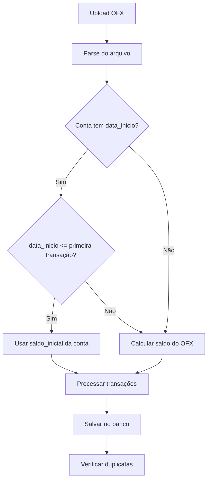

# 🏦 Documentação - Extrato Bancário

## 📋 Índice
1. [Visão Geral](#visão-geral)
2. [Importação de Arquivos OFX](#importação-de-arquivos-ofx)
3. [Cálculo do Saldo Inicial](#cálculo-do-saldo-inicial)
4. [Lógica de Débitos e Créditos](#lógica-de-débitos-e-créditos)
5. [Ordem de Exibição](#ordem-de-exibição)
6. [Filtros Disponíveis](#filtros-disponíveis)
7. [Conciliação de Transações](#conciliação-de-transações)
8. [Deletar Extratos](#deletar-extratos)
9. [Solução de Problemas](#solução-de-problemas)

---

## 🎯 Visão Geral

O módulo de **Extrato Bancário** permite importar transações de arquivos OFX (Open Financial Exchange) baixados do seu banco e visualizá-las de forma cronológica com saldo progressivo.

### Funcionalidades Principais:
- ✅ Importação automática de arquivos OFX
- ✅ Cálculo inteligente de saldo inicial
- ✅ Detecção automática de débitos e créditos
- ✅ Conciliação com lançamentos manuais
- ✅ Filtros por conta, data e status
- ✅ Prevenção de duplicatas
- ✅ Exibição cronológica (do passado para o presente)

---

## 📥 Importação de Arquivos OFX

### Como Importar:

1. **Acesse**: Financeiro → 🏦 Extrato Bancário
2. **Selecione a conta bancária** no dropdown
3. **Clique em "Escolher arquivo"** e selecione o arquivo .ofx
4. **Clique em "📤 Importar Extrato"**

### O que acontece durante a importação:



### Formato do Arquivo:

- **Extensão**: `.ofx` ou `.OFX`
- **Codificação**: UTF-8 ou ANSI
- **Fonte**: Exportado do internet banking do seu banco

### Exemplo de arquivo OFX válido:

```xml
<OFX>
  <SIGNONMSGSRSV1>...</SIGNONMSGSRSV1>
  <BANKMSGSRSV1>
    <STMTTRNRS>
      <STMTRS>
        <BANKTRANLIST>
          <DTSTART>20251101</DTSTART>
          <DTEND>20251130</DTEND>
          <STMTTRN>
            <TRNTYPE>DEBIT</TRNTYPE>
            <DTPOSTED>20251102</DTPOSTED>
            <TRNAMT>-150.00</TRNAMT>
            <FITID>202511020001</FITID>
            <MEMO>PIX ENVIADO</MEMO>
          </STMTTRN>
        </BANKTRANLIST>
        <LEDGERBAL>
          <BALAMT>5500.00</BALAMT>
          <DTASOF>20251130</DTASOF>
        </LEDGERBAL>
      </STMTRS>
    </STMTTRNRS>
  </BANKMSGSRSV1>
</OFX>
```

---

## 💰 Cálculo do Saldo Inicial

### Regra Principal:

O sistema decide como calcular o saldo inicial baseado na **data_inicio** configurada na conta bancária:

#### ✅ Cenário 1: Usar Saldo Inicial Configurado

**Quando:**
- A conta tem `data_inicio` configurada
- A `data_inicio` é **anterior ou igual** à primeira transação do OFX

**Exemplo:**
```
Conta configurada:
├─ Saldo inicial: R$ 560,00
├─ Data início: 01/11/2025
└─ Tipo: Credor (positivo)

Arquivo OFX:
└─ Primeira transação: 02/11/2025

Resultado:
✅ Usa R$ 560,00 como ponto de partida
```

#### 📊 Cenário 2: Calcular do OFX

**Quando:**
- A conta NÃO tem `data_inicio` configurada, OU
- A `data_inicio` é **posterior** à primeira transação do OFX

**Fórmula:**
```
saldo_inicial = saldo_final_ofx - soma_todas_transacoes
```

**Exemplo:**
```
Arquivo OFX:
├─ Saldo final: R$ 5.500,00
├─ Transações: -R$ 4.500, -R$ 1.000
└─ Soma: -R$ 5.500

Cálculo:
saldo_inicial = 5.500 - (-5.500) = R$ 11.000,00

Resultado:
✅ Inicia com R$ 11.000,00
```

---

## 🔄 Lógica de Débitos e Créditos

### Identificação Automática:

O sistema identifica débitos e créditos usando duas estratégias:

#### 1️⃣ Por Tipo OFX (Prioridade):

```python
DÉBITOS:
- DEBIT, DÉBITO, DEB, PAYMENT, ATM
→ Valor convertido para NEGATIVO: -abs(valor)

CRÉDITOS:
- CREDIT, CRÉDITO, CRED, DEPOSIT, XFER (entrada)
→ Valor convertido para POSITIVO: abs(valor)
```

#### 2️⃣ Por Sinal do Valor (Fallback):

```python
Se tipo OFX não informado:
- valor < 0 → DÉBITO (mantém negativo)
- valor > 0 → CRÉDITO (mantém positivo)
```

### Processamento das Transações:

```
Para cada transação (em ordem cronológica):
1. Identificar tipo (DÉBITO ou CRÉDITO)
2. Corrigir sinal do valor
3. Atualizar saldo: saldo += valor
4. Salvar transação com saldo atualizado
```

### Exemplo Prático:

```
Saldo inicial: R$ 5.600,00

┌─────────────┬──────────┬─────────┬───────────────┐
│    Data     │   Tipo   │  Valor  │     Saldo     │
├─────────────┼──────────┼─────────┼───────────────┤
│ 01/11/2025  │    -     │    -    │  R$ 5.600,00  │ ← Inicial
│ 02/11/2025  │ DÉBITO   │ -R$ 150 │  R$ 5.450,00  │ ← 5600 - 150
│ 02/11/2025  │ CRÉDITO  │ +R$ 500 │  R$ 5.950,00  │ ← 5450 + 500
│ 03/11/2025  │ DÉBITO   │ -R$ 200 │  R$ 5.750,00  │ ← 5950 - 200
└─────────────┴──────────┴─────────┴───────────────┘
```

---

## 📅 Ordem de Exibição

### Por que Ordem Crescente (ASC)?

Exibimos as transações **do passado para o presente** (ordem cronológica ascendente) porque:

1. ✅ **Saldo faz sentido visual**: Aumenta com créditos, diminui com débitos
2. ✅ **Ordem natural do tempo**: Como ler um livro (de cima para baixo)
3. ✅ **Facilita análise**: Acompanhar evolução do saldo ao longo do tempo

### Comparação:

#### ❌ Ordem DESC (Errado - visualmente confuso):
```
03/11 - Débito R$ 200 → Saldo: R$ 5.750  ← Mais recente
02/11 - Crédito R$ 500 → Saldo: R$ 5.950 ← Saldo "aumenta" indo para o passado?
02/11 - Débito R$ 150 → Saldo: R$ 5.450  ← Confuso!
01/11 - Inicial        → Saldo: R$ 5.600  ← Mais antigo
```

#### ✅ Ordem ASC (Correto - intuitivo):
```
01/11 - Inicial         → Saldo: R$ 5.600  ← Começa aqui
02/11 - Débito R$ 150  → Saldo: R$ 5.450  ← Diminui (débito)
02/11 - Crédito R$ 500 → Saldo: R$ 5.950  ← Aumenta (crédito)
03/11 - Débito R$ 200  → Saldo: R$ 5.750  ← Diminui (débito)
```

---

## 🔍 Filtros Disponíveis

### 1. **Filtro por Conta**
- Selecione uma conta específica ou "Todas as contas"
- Útil quando você tem múltiplas contas bancárias

### 2. **Filtro por Data**
- **Data Início**: Mostrar transações a partir de
- **Data Fim**: Mostrar transações até
- Formato: `dd/mm/aaaa`

### 3. **Filtro por Status**
- **Todos**: Todas as transações
- **Conciliados**: Apenas transações já vinculadas a lançamentos
- **Pendentes**: Transações ainda não conciliadas

### Como Usar:

1. Configure os filtros desejados
2. Clique em **"🔍 Filtrar"**
3. A tabela será atualizada automaticamente

### Limpar Filtros:

Clique no botão **"🧹 Limpar"** para resetar todos os filtros.

---

## 🔗 Conciliação de Transações

### O que é Conciliação?

Conciliar significa **vincular** uma transação do extrato bancário com um lançamento manual (receita ou despesa).

### Por que Conciliar?

- ✅ Evitar duplicatas (mesma transação registrada 2 vezes)
- ✅ Confirmar que lançamentos foram efetivamente pagos
- ✅ Identificar discrepâncias entre planejado vs realizado

### Como Conciliar:

1. Clique no botão **"🔗 Conciliar"** na transação
2. O sistema sugere lançamentos com:
   - Valor similar (± 10%)
   - Data próxima (± 5 dias)
   - Cliente/Fornecedor compatível
3. Selecione o lançamento correto
4. Clique em **"Confirmar Conciliação"**

### Status de Conciliação:

| Ícone | Status | Descrição |
|-------|--------|-----------|
| ⏳ | Pendente | Ainda não conciliado |
| ✅ | Conciliado | Vinculado a um lançamento |

---

## 🗑️ Deletar Extratos

### Opções de Exclusão:

#### 1. **Deletar Extrato Filtrado**
- Deleta todas as transações que correspondem aos filtros aplicados
- Útil para remover um mês específico ou conta específica

**Passos:**
1. Configure os filtros (conta, data, status)
2. Clique em **"🗑️ Deletar Extrato"**
3. Confirme a exclusão

#### 2. **Deletar por Importação**
- Deleta todas as transações de uma importação específica
- Cada importação de OFX recebe um ID único

### ⚠️ IMPORTANTE:

- **Exclusão é irreversível!**
- Transações conciliadas serão desvinculadas (mas lançamentos continuarão existindo)
- Recomenda-se fazer backup antes de deletar

---

## 🔧 Solução de Problemas

### ❌ Problema: "Saldo está errado após importar OFX"

**Solução:**
1. Verifique se a **data_inicio** está configurada corretamente na conta
2. A data_inicio deve ser **anterior ou igual** à primeira transação do OFX
3. Delete o extrato e reimporte o arquivo OFX

### ❌ Problema: "Transações duplicadas"

**Solução:**
O sistema detecta duplicatas automaticamente pelo `FITID` (ID único da transação).

Se ainda houver duplicatas:
1. Delete o extrato filtrado por data
2. Reimporte o arquivo OFX completo

### ❌ Problema: "Débito aparece com saldo positivo"

**Solução:**
Isso é normal se você está indo para o **passado** na tabela. 

Lembre-se: exibimos em ordem cronológica (ASC):
- Transações antigas = saldo maior (ainda não tinha os débitos futuros)
- Transações recentes = saldo menor (já descontou os débitos)

### ❌ Problema: "Não consigo importar arquivo OFX"

**Verificações:**
1. ✅ Arquivo tem extensão `.ofx`?
2. ✅ Conta bancária está selecionada?
3. ✅ Arquivo não está corrompido?
4. ✅ Arquivo foi exportado do banco (não é um PDF convertido)?

### ❌ Problema: "Sistema calcula saldo diferente do banco"

**Causas possíveis:**
1. **data_inicio errada**: Configure a data correta (quando começou a usar o sistema)
2. **Transações fora do período**: OFX pode ter transações antes da data_inicio
3. **Tarifas não lançadas**: Verifique se há tarifas bancárias no extrato

---

## 📊 Boas Práticas

### 1. **Configure data_inicio antes de importar**
```
✅ CORRETO:
1. Criar conta com saldo inicial e data_inicio
2. Importar OFX com transações posteriores

❌ ERRADO:
1. Importar OFX primeiro
2. Tentar ajustar saldo depois
```

### 2. **Importe extratos mensalmente**
- Facilita identificar períodos específicos
- Reduz chances de duplicatas
- Melhora performance do sistema

### 3. **Concilie regularmente**
- Concilie ao menos uma vez por semana
- Identifique discrepâncias rapidamente
- Mantenha controle sobre o fluxo de caixa

### 4. **Use filtros para análise**
- Filtre por mês para ver movimentações específicas
- Use "Pendentes" para ver o que falta conciliar
- Compare extrato vs lançamentos manuais

---

## 📚 Referências Técnicas

### Formato OFX:
- [Especificação OFX 2.2](https://www.ofx.net/downloads/OFX%202.2.pdf)
- [OFX Banking](https://www.ofx.net/)

### Bibliotecas Utilizadas:
- **ofxparse**: Parser Python para arquivos OFX
- **PostgreSQL**: Banco de dados para armazenamento
- **Flask**: Backend API REST

### Arquivos do Sistema:
- `web_server.py`: Endpoint `/api/extratos/upload` (linhas 2511-2680)
- `extrato_functions.py`: Lógica de negócio do extrato
- `static/app.js`: Frontend (função `loadExtratos`, linha 2198+)

---

## 🆘 Suporte

Se encontrar problemas não documentados aqui:

1. **Verifique os logs do servidor** (terminal onde roda o Flask)
2. **Abra o console do navegador** (F12 → Console)
3. **Anote o erro exato** e envie para o desenvolvedor
4. **Salve o arquivo OFX problemático** para análise

---

**Última atualização**: 19/01/2026  
**Versão**: 2.0.0  
**Status**: ✅ Funcional e testado
