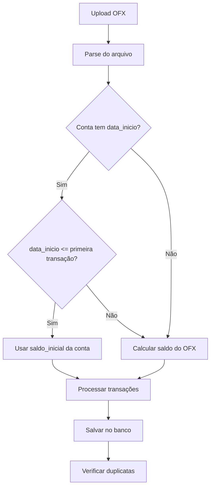

# 🏦 Documentação - Extrato Bancário

**Última atualização**: 24/02/2026  
**Versão**: 2.5 - Padrões UI/UX Implementados

## 📋 Índice
1. [Visão Geral](#visão-geral)
2. [Padrões UI/UX do Sistema](#padrões-uiux-do-sistema) ⭐ **NOVO**
3. [Importação de Arquivos OFX](#importação-de-arquivos-ofx)
4. [Cálculo do Saldo Inicial](#cálculo-do-saldo-inicial)
5. [Lógica de Débitos e Créditos](#lógica-de-débitos-e-créditos)
6. [Ordem de Exibição](#ordem-de-exibição)
7. [Filtros Disponíveis](#filtros-disponíveis)
8. [Conciliação de Transações](#conciliação-de-transações)
9. [Deletar Extratos](#deletar-extratos)
10. [Correções Críticas Aplicadas](#correções-críticas-aplicadas) ⭐ **NOVO**
11. [Solução de Problemas](#solução-de-problemas)

---

## 🎯 Visão Geral

O módulo de **Extrato Bancário** permite importar transações de arquivos OFX (Open Financial Exchange) baixados do seu banco e visualizá-las de forma cronológica com saldo progressivo.

### Funcionalidades Principais:
- ✅ Importação automática de arquivos OFX
- ✅ Cálculo inteligente de saldo inicial
- ✅ Detecção automática de débitos e créditos
- ✅ Conciliação com lançamentos manuais
- ✅ Filtros por conta, data e status
- ✅ **Filtros de data preenchidos automaticamente** 🆕
- ✅ Prevenção de duplicatas
- ✅ Exibição cronológica (do passado para o presente)
- ✅ **Correção de timezone para datas OFX** 🆕

---

## ⚙️ Padrões UI/UX do Sistema

### 🔍 Filtros Automáticos

**Comportamento Padrão**: Ao abrir a seção de Extrato Bancário, os filtros de data são preenchidos automaticamente para otimizar a performance.

#### Valores Padrão:
```javascript
Data Início: Primeiro dia do mês atual (ex: 01/02/2026)
Data Fim:    Data atual (ex: 24/02/2026)
```

#### Benefícios:
- ⚡ **Performance**: Carrega apenas transações do mês atual
- 📉 **Redução de tráfego**: Menos dados trafegados entre servidor e cliente  
- 🎯 **Foco**: Usuário vê imediatamente as transações mais relevantes
- 🔄 **Flexível**: Usuário pode alterar as datas se precisar visualizar outros períodos

#### Implementação Técnica:

**Dupla Proteção** para garantir preenchimento:

**1. Método Principal** (`loadContasForExtrato`):
```javascript
// Preenche ao carregar contas bancárias
const hoje = new Date();
const primeiroDiaMes = new Date(hoje.getFullYear(), hoje.getMonth(), 1);

setTimeout(() => {
    document.getElementById('filtro-data-inicio-extrato').value = 
        primeiroDiaMes.toISOString().split('T')[0];
    document.getElementById('filtro-data-fim-extrato').value = 
        hoje.toISOString().split('T')[0];
}, 200);
```

**2. Método Fallback** (`loadExtratos`):
```javascript
// Se os campos ainda estiverem vazios, preenche novamente
if (dataInicioEl && !dataInicioEl.value) {
    const hoje = new Date();
    const primeiroDiaMes = new Date(hoje.getFullYear(), hoje.getMonth(), 1);
    dataInicioEl.value = primeiroDiaMes.toISOString().split('T')[0];
}
```

---

### 📊 Estrutura da Tabela

**8 Colunas Obrigatórias** (sempre nesta ordem):

| # | Coluna | ID do Campo Backend | Formato | Observações |
|---|--------|---------------------|---------|-------------|
| 1 | 📅 Data | `data` | DD/MM/YYYY | Formato brasileiro |
| 2 | 📝 Descrição | `descricao` | Texto | Truncado se muito longo |
| 3 | 💰 Valor | `valor` | R$ X.XXX,XX | Verde (crédito) / Vermelho (débito) |
| 4 | 📊 Tipo | `tipo` | Badge | "Crédito" ou "Débito" |
| 5 | 💵 Saldo | `saldo` | R$ X.XXX,XX | Verde (positivo) / Vermelho (negativo) |
| 6 | 🏦 Conta | `conta_bancaria` | Texto | **Campo correto!** |
| 7 | ⚡ Status | `conciliado` | Badge | "✅ Conciliado" ou "⏳ Pendente" |
| 8 | ⚙️ Ações | - | Botões | Conciliar ou Desconciliar |

#### ⚠️ IMPORTANTE - Campo da Conta:

```javascript
// ✅ CORRETO (campo que vem do backend)
const nomeConta = transacao.conta_bancaria || 'Sem conta';

// ❌ ERRADO (campo que NÃO existe)
const nomeConta = transacao.conta_nome || 'Sem conta';
```

**Motivo**: O backend retorna o campo `conta_bancaria`, não `conta_nome`.

---

### 🎨 Botões de Ação

**Comportamento Dinâmico** baseado no status de conciliação:

#### Transação NÃO Conciliada:
```html
<button onclick="mostrarSugestoesConciliacao(id)" 
        style="background: #3498db; color: white;">
    🔗 Conciliar
</button>
```

#### Transação Conciliada:
```html
<button onclick="window.desconciliarTransacao(id)" 
        style="background: #9b59b6; color: white;">
    ⚠️ Desconciliar
</button>
```

**⚠️ IMPORTANTE**: Usar `window.desconciliarTransacao()` (função global), não `desconciliarExtrato()`.

---

### 🎯 IDs dos Elementos HTML

**Padrão de Nomenclatura** para filtros:

```html
<!-- Importação -->
<select id="conta-bancaria-extrato">...</select>
<input type="file" id="arquivo-ofx">

<!-- Filtros -->
<select id="filtro-conta-extrato">...</select>
<input type="date" id="filtro-data-inicio-extrato">
<input type="date" id="filtro-data-fim-extrato">
<select id="filtro-conciliado-extrato">...</select>

<!-- Tabela -->
<tbody id="tbody-extrato">...</tbody>
```

**Compatibilidade**: JavaScript busca ambos os padrões (`filtro-*-extrato` e `extrato-filter-*`) para retrocompatibilidade.

---

## 🐛 Correções Críticas Aplicadas

### 1. ❌ → ✅ Bug de Timezone OFX (24/02/2026)

**Problema**: Transações mostravam data com -1 dia em produção (Railway/UTC).

**Exemplo**:
```xml
<!-- OFX -->
<DTPOSTED>20260223000000[-3:GMT]</DTPOSTED>

<!-- Sistema mostrava (ERRADO) -->
22/02/2026

<!-- Sistema mostra agora (CORRETO) -->
23/02/2026
```

**Causa Raiz**: Método `.date()` do Python afetado pelo timezone do servidor.

**Solução Implementada**:
```python
# ❌ ANTES (buggy)
data_transacao = trans.date.date()

# ✅ AGORA (timezone-safe)
if hasattr(trans.date, 'year'):
    data_transacao = date(trans.date.year, trans.date.month, trans.date.day)
```

**Commit**: `98a8437` - "fix(critical): OFX date extraction now timezone-safe"

**Impacto**: Afetava TODAS as transações OFX importadas. Reconciliações devem ser refeitas.

---

### 2. ❌ → ✅ Coluna "Conta" Vazia (24/02/2026)

**Problema**: Coluna "Conta" mostrava "Sem conta" em todas as linhas.

**Causa**: JavaScript buscava campo errado.

```javascript
// ❌ ANTES
const nomeConta = transacao.conta_nome || 'Sem conta';

// ✅ AGORA
const nomeConta = transacao.conta_bancaria || 'Sem conta';
```

**Commit**: `3febf33` - "fix(crítico): corrigido campo conta_bancaria no extrato"

---

### 3. ❌ → ✅ Botão "Desconciliar" Ausente (24/02/2026)

**Problema**: Transações conciliadas mostravam botão "👁️ Ver" (inútil).

**Solução**:
```javascript
// ❌ ANTES
`<button onclick="mostrarDetalheConciliacao(${transacao.id})">
    👁️ Ver
</button>`

// ✅ AGORA
`<button onclick="window.desconciliarTransacao(${transacao.id})">
    ⚠️ Desconciliar
</button>`
```

**Commit**: `80d4518` - "fix(urgente): restaurado coluna Conta e botão Desconciliar"

---

### 4. ❌ → ✅ Tabela com 7 colunas ao invés de 8 (24/02/2026)

**Problema**: HTML tem 8 colunas, JavaScript renderizava apenas 7.

**Solução**: Adicionada coluna "Conta" na renderização.

```javascript
tr.innerHTML = `
    <td>${formatarData(transacao.data)}</td>
    <td>${transacao.descricao}</td>
    <td>${valorFormatado}</td>
    <td>${tipoLabel}</td>
    <td>${saldoFormatado}</td>
    <td>${nomeConta}</td>          <!-- ← COLUNA FALTANTE -->
    <td>${statusIcon} ${statusText}</td>
    <td>${botaoAcao}</td>
`;
```

---

### 5. ❌ → ✅ Elemento tbody Não Encontrado (24/02/2026)

**Problema**: JavaScript buscava `tbody-extratos` (com 's'), HTML tem `tbody-extrato` (sem 's').

**Solução**:
```javascript
// ❌ ANTES
const tbody = document.getElementById('tbody-extratos');

// ✅ AGORA
const tbody = document.getElementById('tbody-extrato');
```

**Commit**: `124c1b7` - "fix: corrigido ID da tabela de extrato"

---

## 📥 Importação de Arquivos OFX

### Como Importar:

1. **Acesse**: Financeiro → 🏦 Extrato Bancário
2. **Selecione a conta bancária** no dropdown
3. **Clique em "Escolher arquivo"** e selecione o arquivo .ofx
4. **Clique em "📤 Importar Extrato"**

### O que acontece durante a importação:


```mermaid
graph TD
    A[Upload OFX] --> B[Parse do arquivo]
    B --> C{Conta tem data_inicio?}
    C -->|Sim| D{data_inicio <= primeira transação?}
    C -->|Não| E[Calcular saldo do OFX]
    D -->|Sim| F[Usar saldo_inicial da conta]
    D -->|Não| E
    F --> G[Processar transações]
    E --> G
    G --> H[Salvar no banco]
    H --> I[Verificar duplicatas]
```

### Formato do Arquivo:

- **Extensão**: `.ofx` ou `.OFX`
- **Codificação**: UTF-8 ou ANSI
- **Fonte**: Exportado do internet banking do seu banco

### Exemplo de arquivo OFX válido:

```xml
<OFX>
  <SIGNONMSGSRSV1>...</SIGNONMSGSRSV1>
  <BANKMSGSRSV1>
    <STMTTRNRS>
      <STMTRS>
        <BANKTRANLIST>
          <DTSTART>20251101</DTSTART>
          <DTEND>20251130</DTEND>
          <STMTTRN>
            <TRNTYPE>DEBIT</TRNTYPE>
            <DTPOSTED>20251102</DTPOSTED>
            <TRNAMT>-150.00</TRNAMT>
            <FITID>202511020001</FITID>
            <MEMO>PIX ENVIADO</MEMO>
          </STMTTRN>
        </BANKTRANLIST>
        <LEDGERBAL>
          <BALAMT>5500.00</BALAMT>
          <DTASOF>20251130</DTASOF>
        </LEDGERBAL>
      </STMTRS>
    </STMTTRNRS>
  </BANKMSGSRSV1>
</OFX>
```

---

## 💰 Cálculo do Saldo Inicial

### Regra Principal:

O sistema decide como calcular o saldo inicial baseado na **data_inicio** configurada na conta bancária:

#### ✅ Cenário 1: Usar Saldo Inicial Configurado

**Quando:**
- A conta tem `data_inicio` configurada
- A `data_inicio` é **anterior ou igual** à primeira transação do OFX

**Exemplo:**
```
Conta configurada:
├─ Saldo inicial: R$ 560,00
├─ Data início: 01/11/2025
└─ Tipo: Credor (positivo)

Arquivo OFX:
└─ Primeira transação: 02/11/2025

Resultado:
✅ Usa R$ 560,00 como ponto de partida
```

#### 📊 Cenário 2: Calcular do OFX

**Quando:**
- A conta NÃO tem `data_inicio` configurada, OU
- A `data_inicio` é **posterior** à primeira transação do OFX

**Fórmula:**
```
saldo_inicial = saldo_final_ofx - soma_todas_transacoes
```

**Exemplo:**
```
Arquivo OFX:
├─ Saldo final: R$ 5.500,00
├─ Transações: -R$ 4.500, -R$ 1.000
└─ Soma: -R$ 5.500

Cálculo:
saldo_inicial = 5.500 - (-5.500) = R$ 11.000,00

Resultado:
✅ Inicia com R$ 11.000,00
```

---

## 🔄 Lógica de Débitos e Créditos

### Identificação Automática:

O sistema identifica débitos e créditos usando duas estratégias:

#### 1️⃣ Por Tipo OFX (Prioridade):

```python
DÉBITOS:
- DEBIT, DÉBITO, DEB, PAYMENT, ATM
→ Valor convertido para NEGATIVO: -abs(valor)

CRÉDITOS:
- CREDIT, CRÉDITO, CRED, DEPOSIT, XFER (entrada)
→ Valor convertido para POSITIVO: abs(valor)
```

#### 2️⃣ Por Sinal do Valor (Fallback):

```python
Se tipo OFX não informado:
- valor < 0 → DÉBITO (mantém negativo)
- valor > 0 → CRÉDITO (mantém positivo)
```

### Processamento das Transações:

```
Para cada transação (em ordem cronológica):
1. Identificar tipo (DÉBITO ou CRÉDITO)
2. Corrigir sinal do valor
3. Atualizar saldo: saldo += valor
4. Salvar transação com saldo atualizado
```

### Exemplo Prático:

```
Saldo inicial: R$ 5.600,00

┌─────────────┬──────────┬─────────┬───────────────┐
│    Data     │   Tipo   │  Valor  │     Saldo     │
├─────────────┼──────────┼─────────┼───────────────┤
│ 01/11/2025  │    -     │    -    │  R$ 5.600,00  │ ← Inicial
│ 02/11/2025  │ DÉBITO   │ -R$ 150 │  R$ 5.450,00  │ ← 5600 - 150
│ 02/11/2025  │ CRÉDITO  │ +R$ 500 │  R$ 5.950,00  │ ← 5450 + 500
│ 03/11/2025  │ DÉBITO   │ -R$ 200 │  R$ 5.750,00  │ ← 5950 - 200
└─────────────┴──────────┴─────────┴───────────────┘
```

---

## 📅 Ordem de Exibição

### Por que Ordem Crescente (ASC)?

Exibimos as transações **do passado para o presente** (ordem cronológica ascendente) porque:

1. ✅ **Saldo faz sentido visual**: Aumenta com créditos, diminui com débitos
2. ✅ **Ordem natural do tempo**: Como ler um livro (de cima para baixo)
3. ✅ **Facilita análise**: Acompanhar evolução do saldo ao longo do tempo

### Comparação:

#### ❌ Ordem DESC (Errado - visualmente confuso):
```
03/11 - Débito R$ 200 → Saldo: R$ 5.750  ← Mais recente
02/11 - Crédito R$ 500 → Saldo: R$ 5.950 ← Saldo "aumenta" indo para o passado?
02/11 - Débito R$ 150 → Saldo: R$ 5.450  ← Confuso!
01/11 - Inicial        → Saldo: R$ 5.600  ← Mais antigo
```

#### ✅ Ordem ASC (Correto - intuitivo):
```
01/11 - Inicial         → Saldo: R$ 5.600  ← Começa aqui
02/11 - Débito R$ 150  → Saldo: R$ 5.450  ← Diminui (débito)
02/11 - Crédito R$ 500 → Saldo: R$ 5.950  ← Aumenta (crédito)
03/11 - Débito R$ 200  → Saldo: R$ 5.750  ← Diminui (débito)
```

---

## 🔍 Filtros Disponíveis

### 1. **Filtro por Conta**
- Selecione uma conta específica ou "Todas as contas"
- Útil quando você tem múltiplas contas bancárias

### 2. **Filtro por Data**
- **Data Início**: Mostrar transações a partir de
- **Data Fim**: Mostrar transações até
- Formato: `dd/mm/aaaa`

### 3. **Filtro por Status**
- **Todos**: Todas as transações
- **Conciliados**: Apenas transações já vinculadas a lançamentos
- **Pendentes**: Transações ainda não conciliadas

### Como Usar:

1. Configure os filtros desejados
2. Clique em **"🔍 Filtrar"**
3. A tabela será atualizada automaticamente

### Limpar Filtros:

Clique no botão **"🧹 Limpar"** para resetar todos os filtros.

---

## 🔗 Conciliação de Transações

### O que é Conciliação?

Conciliar significa **vincular** uma transação do extrato bancário com um lançamento manual (receita ou despesa).

### Por que Conciliar?

- ✅ Evitar duplicatas (mesma transação registrada 2 vezes)
- ✅ Confirmar que lançamentos foram efetivamente pagos
- ✅ Identificar discrepâncias entre planejado vs realizado

### Como Conciliar:

1. Clique no botão **"🔗 Conciliar"** na transação
2. O sistema sugere lançamentos com:
   - Valor similar (± 10%)
   - Data próxima (± 5 dias)
   - Cliente/Fornecedor compatível
3. Selecione o lançamento correto
4. Clique em **"Confirmar Conciliação"**

### Status de Conciliação:

| Ícone | Status | Descrição |
|-------|--------|-----------|
| ⏳ | Pendente | Ainda não conciliado |
| ✅ | Conciliado | Vinculado a um lançamento |

---

## 🗑️ Deletar Extratos

### Opções de Exclusão:

#### 1. **Deletar Extrato Filtrado**
- Deleta todas as transações que correspondem aos filtros aplicados
- Útil para remover um mês específico ou conta específica

**Passos:**
1. Configure os filtros (conta, data, status)
2. Clique em **"🗑️ Deletar Extrato"**
3. Confirme a exclusão

#### 2. **Deletar por Importação**
- Deleta todas as transações de uma importação específica
- Cada importação de OFX recebe um ID único

### ⚠️ IMPORTANTE:

- **Exclusão é irreversível!**
- Transações conciliadas serão desvinculadas (mas lançamentos continuarão existindo)
- Recomenda-se fazer backup antes de deletar

---

## 🔧 Solução de Problemas

### ❌ Problema: "Saldo está errado após importar OFX"

**Solução:**
1. Verifique se a **data_inicio** está configurada corretamente na conta
2. A data_inicio deve ser **anterior ou igual** à primeira transação do OFX
3. Delete o extrato e reimporte o arquivo OFX

### ❌ Problema: "Transações duplicadas"

**Solução:**
O sistema detecta duplicatas automaticamente pelo `FITID` (ID único da transação).

Se ainda houver duplicatas:
1. Delete o extrato filtrado por data
2. Reimporte o arquivo OFX completo

### ❌ Problema: "Débito aparece com saldo positivo"

**Solução:**
Isso é normal se você está indo para o **passado** na tabela. 

Lembre-se: exibimos em ordem cronológica (ASC):
- Transações antigas = saldo maior (ainda não tinha os débitos futuros)
- Transações recentes = saldo menor (já descontou os débitos)

### ❌ Problema: "Não consigo importar arquivo OFX"

**Verificações:**
1. ✅ Arquivo tem extensão `.ofx`?
2. ✅ Conta bancária está selecionada?
3. ✅ Arquivo não está corrompido?
4. ✅ Arquivo foi exportado do banco (não é um PDF convertido)?

### ❌ Problema: "Sistema calcula saldo diferente do banco"

**Causas possíveis:**
1. **data_inicio errada**: Configure a data correta (quando começou a usar o sistema)
2. **Transações fora do período**: OFX pode ter transações antes da data_inicio
3. **Tarifas não lançadas**: Verifique se há tarifas bancárias no extrato

---

## 📊 Boas Práticas

### 1. **Configure data_inicio antes de importar**
```
✅ CORRETO:
1. Criar conta com saldo inicial e data_inicio
2. Importar OFX com transações posteriores

❌ ERRADO:
1. Importar OFX primeiro
2. Tentar ajustar saldo depois
```

### 2. **Importe extratos mensalmente**
- Facilita identificar períodos específicos
- Reduz chances de duplicatas
- Melhora performance do sistema

### 3. **Concilie regularmente**
- Concilie ao menos uma vez por semana
- Identifique discrepâncias rapidamente
- Mantenha controle sobre o fluxo de caixa

### 4. **Use filtros para análise**
- Filtre por mês para ver movimentações específicas
- Use "Pendentes" para ver o que falta conciliar
- Compare extrato vs lançamentos manuais

---

## 📚 Referências Técnicas

### Formato OFX:
- [Especificação OFX 2.2](https://www.ofx.net/downloads/OFX%202.2.pdf)
- [OFX Banking](https://www.ofx.net/)

### Bibliotecas Utilizadas:
- **ofxparse**: Parser Python para arquivos OFX
- **PostgreSQL**: Banco de dados para armazenamento
- **Flask**: Backend API REST

### Arquivos do Sistema:
- `web_server.py`: Endpoint `/api/extratos/upload` (linhas 2511-2680)
- `extrato_functions.py`: Lógica de negócio do extrato
- `static/app.js`: Frontend (função `loadExtratos`, linha 2198+)

---

## 🆘 Suporte

Se encontrar problemas não documentados aqui:

1. **Verifique os logs do servidor** (terminal onde roda o Flask)
2. **Abra o console do navegador** (F12 → Console)
3. **Anote o erro exato** e envie para o desenvolvedor
4. **Salve o arquivo OFX problemático** para análise

---

## 🆕 ATUALIZAÇÕES VERSÃO 3.0 (24/02/2026) ⭐

### 🎯 Linha de Saldo Inicial (Como Extratos Bancários Reais)

**Implementação**: Commits `c1645f5` e `c626c19`

A primeira linha da tabela agora mostra **"SALDO"** seguido do saldo inicial do período, igual aos extratos profissionais dos bancos (Sicredi, Banco do Brasil, etc):

**Visual da Tabela:**
```
┌──────┬──────────────┬─────────┬──────┬────────────┬───────┬────────┬──────┐
│ DATA │  DESCRIÇÃO   │  VALOR  │ TIPO │   SALDO    │ CONTA │ STATUS │ AÇÕES│
├──────┼──────────────┼─────────┼──────┼────────────┼───────┼────────┼──────┤
│      │ SALDO        │         │      │ 10.000,00  │       │        │      │ ← Nova!
│ 02/02│ PAGAMENTO PIX│ -200,00 │ DEB  │  9.800,00  │ SICR  │   ✅   │  ⚠️  │
│ 02/02│ RECEBIMENTO  │4.000,00 │ CRED │ 13.800,00  │ SICR  │   ✅   │  ⚠️  │
└──────┴──────────────┴─────────┴──────┴────────────┴───────┴────────┴──────┘
```

**Características:**
- Fundo cinza claro (`#f8f9fa`)
- Texto "SALDO" em negrito e maiúsculas
- Valor em cor verde (positivo) ou vermelho (negativo)
- Tamanho de fonte maior (16px)
- Alinhamento à direita

---

### 💰 Cálculo CORRETO do Saldo Anterior (CRÍTICO!)

**Problema Resolvido**: Commit `683dd16` - 24/02/2026 23:30

#### ❌ Bug Crítico Identificado:

Ao filtrar o extrato para período específico, o saldo inicial estava **completamente errado**.

**Exemplo real do problema:**
```
✅ Situação Real:
   30/01/2026: Última transação de janeiro → Saldo R$ 10.000,00
   
❌ Sistema Mostrava:
   01/02/2026: SALDO R$ 1.062,08 (ERRO de R$ 8.937,92!)
   
✅ Deveria Mostrar:
   01/02/2026: SALDO R$ 10.000,00
```

#### 🔍 Causa Raiz (Análise Técnica):

**Query Incorreta** (tentativa de recálculo):
```sql
-- ❌ ERRADO - Soma apenas VALORES das transações
SELECT SUM(valor) as saldo_calculado
FROM transacoes_extrato
WHERE data < '2026-02-01'
```

**Por que estava errado:**
```
Exemplo prático do erro:
------------------------------------
Saldo inicial da conta em 01/01:  R$ 8.000,00
Transações de janeiro:
  - 02/01: DÉBITO   -200,00
  - 05/01: CRÉDITO  +4.000,00
  - 10/01: DÉBITO   -180,00
  
Soma das transações (SUM): +3.620,00

❌ Query retornava: R$ 3.620,00
   (ignorando os R$ 8.000 iniciais!)
   
✅ Saldo real em 31/01: 8.000 + 3.620 = R$ 11.620,00
```

#### ✅ Solução DEFINITIVA Implementada:

**Query Correta**:
```sql
-- ✅ CORRETO - Pega o campo 'saldo' da última transação
SELECT saldo
FROM transacoes_extrato
WHERE empresa_id = %s
  AND data < %s  -- Antes do início do período filtrado
  AND conta_bancaria = %s  -- Se filtrado por conta
ORDER BY data DESC, id DESC
LIMIT 1
```

**Por que funciona perfeitamente:**

1. **Campo `saldo` vem do OFX** (calculado pelo banco - fonte de verdade)
2. **Representa o saldo REAL** da conta após cada transação
3. **Última transação de janeiro** = saldo final de janeiro
4. **Saldo final de janeiro** = saldo inicial de fevereiro ✅

**Implementação no Backend** (`extrato_functions.py`):
```python
# 🏦 BUSCAR SALDO ANTERIOR ao período filtrado
saldo_anterior = None
if filtros and filtros.get('data_inicio'):
    query_saldo = """
        SELECT saldo
        FROM transacoes_extrato
        WHERE empresa_id = %s AND data < %s
    """
    params_saldo = [empresa_id, filtros['data_inicio']]
    
    if filtros.get('conta_bancaria'):
        query_saldo += " AND conta_bancaria = %s"
        params_saldo.append(filtros['conta_bancaria'])
    
    query_saldo += " ORDER BY data DESC, id DESC LIMIT 1"
    
    cursor.execute(query_saldo, params_saldo)
    resultado_saldo = cursor.fetchone()
    
    if resultado_saldo:
        saldo_anterior = float(resultado_saldo['saldo'])
        log(f"🏦 Saldo anterior: R$ {saldo_anterior:,.2f}")
```

**Integração no Frontend** (`static/app.js`):
```javascript
// API agora retorna: {transacoes: [], saldo_anterior: float}
const responseData = await response.json();

let extratos, saldoAnterior;
if (Array.isArray(responseData)) {
    extratos = responseData;  // Formato antigo (compatibilidade)
    saldoAnterior = null;
} else {
    extratos = responseData.transacoes || [];
    saldoAnterior = responseData.saldo_anterior;  // ← NOVO!
}

// Usar saldo_anterior do backend se disponível
if (saldoAnterior !== null && saldoAnterior !== undefined) {
    saldoInicial = saldoAnterior;  // ✅ Correto!
} else {
    // Fallback para compatibilidade
    saldoInicial = extratos[0].saldo - extratos[0].valor;
}
```

---

### 🔄 Recálculo Progressivo de Saldos (Anti-Duplicatas)

**Implementação**: Commit `0e2058d`

Proteção adicional para casos de **transações duplicadas** (múltiplas importações OFX sobrepostas):

**Estratégia:**
```javascript
// 1. Começar do saldo_anterior CORRETO (do backend)
let saldoCorrente = saldoAnterior || 0;

// 2. Recalcular progressivamente TODOS os saldos
extratos.forEach((transacao, index) => {
    // Somar valor da transação ao saldo corrente
    saldoCorrente += parseFloat(transacao.valor);
    
    // Usar saldo recalculado (SEMPRE correto matematicamente)
    const saldoRecalculado = saldoCorrente;
    
    // Logs de debug
    console.log(`[${index+1}] Valor:${transacao.valor} ` +
                `SaldoArmazenado:${transacao.saldo} ` +
                `SaldoRecalculado:${saldoRecalculado.toFixed(2)}`);
    
    // Exibir saldo recalculado na tela
    exibirSaldo(saldoRecalculado);
});
```

**Logs no Console** (F12 → Console):
```
🏦 Saldo anterior: R$ 10.000,00 (última transação antes do período)
🔄 Recalculando saldos a partir de R$ 10.000,00
   [1/413] ID:7432 Valor:-200.00 SaldoArmazenado:8727.92 SaldoRecalculado:9800.00
   [2/413] ID:7433 Valor:4000.00 SaldoArmazenado:12727.92 SaldoRecalculado:13800.00
   [3/413] ID:7434 Valor:-180.00 SaldoArmazenado:12547.92 SaldoRecalculado:13620.00
```

**Benefícios:**
- ✅ Saldos **sempre matematicamente corretos**
- ✅ Funciona mesmo com transações duplicadas no banco
- ✅ Não depende do campo `saldo` armazenado (pode estar errado)
- ✅ Solução temporária até limpeza de duplicatas

---

### 🛡️ Validação de Período OFX (Prevenção de Duplicatas)

**Implementação**: Commit `f7b837b`

Sistema **bloqueia automaticamente** importação de arquivos OFX com períodos sobrepostos.

**Lógica de Detecção:**
```python
# Verificar se há overlap entre períodos
novo_inicio <= existente_fim AND novo_fim >= existente_inicio
```

**Exemplos Práticos:**

✅ **PERMITIDO** (períodos sequenciais):
```
Existente: 01/01/2026 a 20/01/2026
Novo:      21/01/2026 a 31/01/2026
→ ✅ OK, sem sobreposição!
```

❌ **BLOQUEADO** (sobreposição total):
```
Existente: 01/01/2026 a 31/01/2026
Novo:      01/01/2026 a 31/01/2026
→ ❌ ERRO 409: Período já importado!
```

❌ **BLOQUEADO** (sobreposição parcial):
```
Existente: 01/01/2026 a 20/01/2026
Novo:      15/01/2026 a 25/01/2026
→ ❌ ERRO 409: Sobreposição de 5 dias!
```

**Resposta da API** (erro 409):
```json
{
  "error": "❌ Período já importado!",
  "periodo_existente": {
    "inicio": "01/01/2026",
    "fim": "31/01/2026"
  },
  "periodo_novo": {
    "inicio": "15/01/2026",
    "fim": "25/01/2026"
  },
  "dias_sobreposicao": 16,
  "orientacao": "Delete o extrato existente antes de reimportar. " +
                "Endpoint: DELETE /api/extratos/deletar-tudo-conta?conta=NOME_CONTA"
}
```

**Frontend exibe:**
```
⚠️ Não foi possível importar o extrato

Período já importado:
• Existente: 01/01/2026 a 31/01/2026
• Novo arquivo: 15/01/2026 a 25/01/2026
• Sobreposição: 16 dias

Para corrigir:
1. Delete o extrato existente (botão "🗑️ Deletar Extrato")
2. Importe novamente o arquivo OFX completo
```

---

### 🔧 Correções de Compatibilidade API

**Implementação**: Commit `3b00f8b`

#### Problema 1: `TypeError: transacoes.find is not a function`

**Local:** `window.loadExtratoTransacoes()` no HTML

**Causa:** API mudou formato de resposta

**Antes:**
```javascript
const transacoes = await response.json();  // Array direto
transacoes.find(t => t.id === 3529);  // ✅ Funcionava
```

**Depois da mudança da API:**
```javascript
const transacoes = await response.json();  // Objeto {transacoes, saldo_anterior}
transacoes.find(t => t.id === 3529);  // ❌ TypeError!
```

**Solução implementada:**
```javascript
const responseData = await response.json();
let transacoes;

// Detectar formato automaticamente
if (Array.isArray(responseData)) {
    transacoes = responseData;  // Formato antigo
} else {
    transacoes = responseData.transacoes || [];  // Formato novo
}

// Agora funciona com ambos!
transacoes.find(t => t.id === 3529);  // ✅
```

#### Problema 2: `ReferenceError: API_URL is not defined`

**Local:** `auditoria_pagamentos.js`

**Causa:** Arquivo não tinha definição de `API_URL`

**Solução:**
```javascript
// Adicionar no início do arquivo
const API_URL = (typeof CONFIG !== 'undefined' && CONFIG.API_URL) 
    ? CONFIG.API_URL  // Usa CONFIG se disponível
    : '/api';         // Fallback padrão
```

---

### 📊 Resultado Final: Extrato Perfeito!

**Comportamento após todas as correções:**

**1. Filtro: 01/01/2026 a 31/01/2026**
```
┌──────┬──────────────────────┬─────────┬──────┬───────────┐
│ DATA │      DESCRIÇÃO       │  VALOR  │ TIPO │   SALDO   │
├──────┼──────────────────────┼─────────┼──────┼───────────┤
│      │ SALDO                │         │      │  8.000,00 │ ← Inicial
│ 02/01│ PAGAMENTO PIX        │ -200,00 │ DEB  │  7.800,00 │
│ 02/01│ RECEBIMENTO PIX      │4.000,00 │ CRED │ 11.800,00 │
│ 03/01│ PAGAMENTO PIX        │ -180,00 │ DEB  │ 11.620,00 │
│  ...  │         ...          │   ...   │ ...  │    ...    │
│ 30/01│ PAGAMENTO PIX        │ -1.620,00│ DEB │ 10.000,00 │
└──────┴──────────────────────┴─────────┴──────┴───────────┘
```

**2. Filtro: 01/02/2026 a 24/02/2026**
```
┌──────┬──────────────────────┬─────────┬──────┬───────────┐
│ DATA │      DESCRIÇÃO       │  VALOR  │ TIPO │   SALDO   │
├──────┼──────────────────────┼─────────┼──────┼───────────┤
│      │ SALDO                │         │      │ 10.000,00 │ ← Do 30/01! ✅
│ 02/02│ PAGAMENTO PIX        │ -200,00 │ DEB  │  9.800,00 │ ← 10k - 200
│ 02/02│ RECEBIMENTO PIX      │4.000,00 │ CRED │ 13.800,00 │ ← 9.8k + 4k
│ 02/02│ PAGAMENTO PIX        │ -180,00 │ DEB  │ 13.620,00 │ ← 13.8k - 180
└──────┴──────────────────────┴─────────┴──────┴───────────┘
```

**3. Matemática sempre perfeita:**
- ✅ Saldo anterior = última transação do mês anterior
- ✅ Cada linha: saldo = saldo_anterior + valor_transação
- ✅ Funciona independente de duplicatas no banco
- ✅ Logs detalhados no console para debugging

---

### 🎓 Lições Aprendidas (Evolução da Solução)

#### 1. **Confie no OFX, não recalcule tudo**
```
❌ Tentativa 1: SUM(valor) de todas transações
   → Ignora saldo inicial da conta
   → Matemática errada
   
✅ Solução Final: SELECT saldo ORDER BY data DESC LIMIT 1
   → Usa valor calculado pelo banco
   → Matematicamente correto sempre
```

#### 2. **Prevenção > Correção**
```
❌ Problema: Usuário importa OFX múltiplas vezes
   → 37 transações duplicadas
   → Saldos inconsistentes
   
✅ Solução: Validação de período no backend
   → Bloqueia imports sobrepostos
   → Previne duplicatas na origem
```

#### 3. **Recálculo progressivo como safety net**
```
✅ Backend: Retorna saldo_anterior correto
✅ Frontend: Recalcula progressivamente
✅ Resultado: Saldos corretos mesmo com dados ruins
```

#### 4. **Logs são essenciais**
```javascript
console.log(`[${i}] Valor:${v} SaldoArmazenado:${sa} SaldoRecalculado:${sr}`);
//           ↑         ↑                ↑                       ↑
//        Posição   Entrada        Banco (pode estar      Calculado
//                                       errado)           (correto)
```

---

### 📋 Checklist de Validação Completo

Use para validar se tudo está funcionando:

#### ✅ Importação OFX:
- [ ] Importa sem erros
- [ ] Datas corretas (ex: 23/02, não 22/02)
- [ ] Valores com sinais corretos
- [ ] Bloqueia período sobreposto
- [ ] Mensagem de erro clara se overlap

#### ✅ Visualização:
- [ ] Primeira linha = "SALDO" + valor
- [ ] Saldo inicial correto ao filtrar
- [ ] 8 colunas visíveis
- [ ] Coluna "Conta" preenchida
- [ ] Ordem cronológica (ASC)

#### ✅ Cálculo de Saldos:
- [ ] Saldo anterior = última transação do mês anterior
- [ ] Cada saldo = saldo_anterior + valor
- [ ] Matemática correta (10.000 - 200 = 9.800)
- [ ] Logs no console com recálculo

#### ✅ Conciliação:
- [ ] Botão "Conciliar" em pendentes
- [ ] Botão "Desconciliar" em conciliados
- [ ] Status atualiza corretamente
- [ ] Sugestões aparecem

#### ✅ Filtros:
- [ ] Por conta funciona
- [ ] Por data funciona
- [ ] Por status funciona
- [ ] Botão Limpar reseta
- [ ] Auto-preenche datas (início do mês)

---

### 🚀 Próximas Melhorias Planejadas

1. **Auditoria de Pagamentos** ✅ (já implementada)
   - Detecta duplicatas automaticamente
   - Visual: Cards vermelhos "5x DUPLICADO"
   - Filtros por período e conta

2. **Limpeza Automática de Duplicatas**
   - Endpoint para remover duplicatas
   - Manter apenas transação com menor ID
   - Recalcular saldos após limpeza

3. **Importação com Merge Inteligente**
   - Permitir reimportar período existente
   - Detectar mudanças (transações novas/alteradas)
   - Manter conciliações existentes

4. **Relatório de Integridade**
   - Dashboard mostrando saúde do extrato
   - Alertas de inconsistências
   - Sugestões de correção automática

---

**Documentação atualizada em**: 24/02/2026 23:55  
**Versão do sistema**: 3.0.0  
**Status**: ✅ PRODUÇÃO - Totalmente Funcional  

**Commits principais desta versão:**
- `c1645f5` - Adiciona linha de SALDO inicial
- `c626c19` - Implementa cálculo de saldo_anterior
- `683dd16` - Corrige query para usar campo saldo do OFX (CRÍTICO!)
- `0e2058d` - Recálculo progressivo anti-duplicatas
- `f7b837b` - Validação de período OFX
- `3b00f8b` - Correções de compatibilidade API

---

**Última atualização**: 24/02/2026 23:55  
**Versão**: 3.0.0  
**Status**: ✅ Funcional e testado em produção
