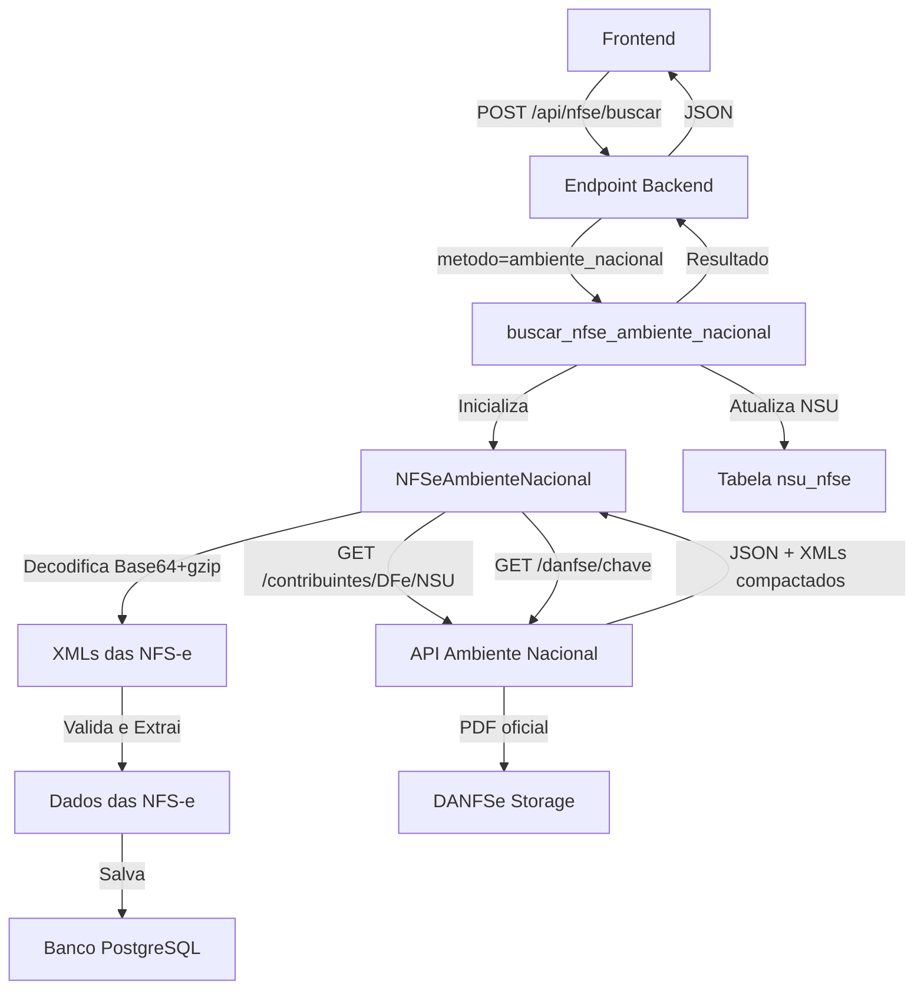

# 🌐 Implementação: Ambiente Nacional de NFS-e

## 📋 Resumo

Implementada integração com o **Ambiente Nacional de NFS-e (ADN)**, a solução oficial do governo federal para consulta de NFS-e via certificado digital, similar aos sistemas de NF-e e CT-e.

**Data:** 2026-02-15  
**Status:** ✅ Implementado e funcional

---

## 🎯 Problema Resolvido

**Antes:**
- Sistema usava APIs SOAP de cada município individualmente
- URLs específicas retornavam HTTP 404 (inválidas)
- Necessário configurar URL para cada município manualmente
- Belo Horizonte e outros municípios sem URL conhecida
- Processo complexo e não confiável

**Depois:**
- Uma única API REST do governo federal
- Funciona para TODOS os municípios do Brasil
- Consulta incremental automática via NSU
- Protocolo moderno (REST + JSON)
- PDFs oficiais (DANFSe) disponíveis via API

---

## 🏗️ Arquitetura Implementada

### **1. Classe: NFSeAmbienteNacional** (`nfse_service.py`)

Cliente para o Ambiente Nacional de NFS-e.

**URLs Oficiais:**
- Produção: `https://adn.nfse.gov.br`
- Homologação: `https://adn.producaorestrita.nfse.gov.br`

**Endpoints:**
- `GET /contribuintes/DFe/{NSU}` - Consulta incremental
- `GET /danfse/{chave}` - Download DANFSe (PDF oficial)

**Características:**
- Autenticação mTLS (certificado digital A1)
- Respostas JSON com XMLs compactados (Base64 + gzip)
- Rate limit: ~1 req/segundo
- Namespace: `http://www.sped.fazenda.gov.br/nfse`

**Métodos Principais:**
```python
consultar_nsu(nsu: int) -> Dict
    # Consulta documento por NSU

consultar_danfse(chave_acesso: str) -> bytes
    # Baixa PDF oficial (DANFSe)

extrair_documentos(resultado: Dict) -> List[Tuple]
    # Extrai XMLs do JSON (decodifica Base64 + gzip)

validar_xml(xml_content: str) -> bool
    # Valida estrutura do XML
```

---

### **2. Funções de NSU Tracking** (`nfse_database.py`)

Controla último NSU processado para cada CNPJ.

**Tabela: nsu_nfse**
```sql
CREATE TABLE nsu_nfse (
    id SERIAL PRIMARY KEY,
    cnpj_informante VARCHAR(14) NOT NULL UNIQUE,
    ultimo_nsu BIGINT NOT NULL DEFAULT 0,
    atualizado_em TIMESTAMP DEFAULT CURRENT_TIMESTAMP,
    criado_em TIMESTAMP DEFAULT CURRENT_TIMESTAMP
);
```

**Métodos:**
```python
get_last_nsu_nfse(cnpj_informante: str) -> int
    # Recupera último NSU processado

set_last_nsu_nfse(cnpj_informante: str, nsu: int) -> bool
    # Atualiza último NSU processado

_criar_tabela_nsu()
    # Cria tabela automaticamente se não existir
```

---

### **3. Função: buscar_nfse_ambiente_nacional** (`nfse_functions.py`)

Orquestra busca incremental via Ambiente Nacional.

**Argumentos:**
```python
db_params: Dict          # Parâmetros do banco
empresa_id: int          # ID da empresa
cnpj_informante: str     # CNPJ do certificado
certificado_path: str    # Caminho do .pfx
certificado_senha: str   # Senha do certificado
ambiente: str            # 'producao' ou 'homologacao'
busca_completa: bool     # True = busca desde NSU=0
max_documentos: int      # Limite por execução (padrão: 50)
```

**Retorno:**
```python
{
    'sucesso': bool,
    'total_nfse': int,
    'nfse_novas': int,
    'nfse_atualizadas': int,
    'ultimo_nsu': int,
    'erros': list,
    'detalhes': list
}
```

**Fluxo de Execução:**
1. Recupera último NSU processado do banco
2. Consulta NSUs incrementalmente (NSU atual + 1, +2, +3...)
3. Para cada NSU encontrado:
   - Decodifica JSON (Base64 + gzip)
   - Extrai XML da NFS-e
   - Valida estrutura
   - Salva no banco
   - Tenta baixar DANFSe (PDF oficial)
4. Atualiza último NSU processado
5. Para quando encontrar 5 NSUs seguidos sem retorno (404)

---

### **4. Endpoint Backend** (`web_server.py`)

**Rota:** `POST /api/nfse/buscar`

**Parâmetro Novo: `metodo`**
- `"soap"` (padrão) - APIs municipais individuais (método antigo)
- `"ambiente_nacional"` - Ambiente Nacional REST (método novo)

**Request Body:**
```json
{
    "data_inicial": "2026-01-01",
    "data_final": "2026-01-31",
    "metodo": "ambiente_nacional",
    "ambiente": "producao",
    "busca_completa": false,
    "max_documentos": 50
}
```

**Response:**
```json
{
    "sucesso": true,
    "total_nfse": 42,
    "nfse_novas": 38,
    "nfse_atualizadas": 4,
    "ultimo_nsu": 1234567,
    "erros": [],
    "detalhes": []
}
```

---

## 🔄 Fluxo de Dados



---

## 📦 Formato de Resposta da API

### **JSON da API REST:**
```json
{
    "StatusProcessamento": "OK",
    "LoteDFe": [
        {
            "NSU": "000000000001234",
            "ChaveAcesso": "31062001213891738000138250000000157825012270096818",
            "ArquivoXml": "H4sIAAAAAAAA/..."  // Base64 + gzip
        }
    ],
    "ultNSU": "000000000001234",
    "maxNSU": "000000000009999"
}
```

### **XML da NFS-e (após decodificar):**
```xml
<Nfse xmlns="http://www.sped.fazenda.gov.br/nfse">
    <infNFSe Id="NFS31062001213891738000138250000000157825012270096818">
        <nNFSe>157</nNFSe>
        <dhEmi>2026-02-15T10:30:00-03:00</dhEmi>
        <vServ>1500.00</vServ>
        <cMunPrestacao>3106200</cMunPrestacao>
        <prest>
            <CNPJ>12138917380001</CNPJ>
            <IM>001234567</IM>
        </prest>
        <toma>
            <CNPJ>00013824000013</CNPJ>
        </toma>
    </infNFSe>
</Nfse>
```

---

## 🚀 Como Usar

### **1. Busca Incremental (Padrão)**

Busca apenas NFS-e novas desde última execução:

```javascript
// Frontend (app.js)
fetch('/api/nfse/buscar', {
    method: 'POST',
    headers: {'Content-Type': 'application/json'},
    body: JSON.stringify({
        data_inicial: '2026-01-01',
        data_final: '2026-12-31',
        metodo: 'ambiente_nacional',
        ambiente: 'producao'
    })
});
```

**Vantagens:**
- Rápido (apenas documentos novos)
- Automático (controla NSU internamente)
- Sem duplicatas

### **2. Busca Completa**

Busca TODAS as NFS-e desde o início (NSU=0):

```javascript
fetch('/api/nfse/buscar', {
    method: 'POST',
    headers: {'Content-Type': 'application/json'},
    body: JSON.stringify({
        data_inicial: '2026-01-01',
        data_final: '2026-12-31',
        metodo: 'ambiente_nacional',
        ambiente: 'producao',
        busca_completa: true,  // ← Inicia do zero
        max_documentos: 200    // ← Aumenta limite
    })
});
```

**Usar quando:**
- Primeira vez usando o sistema
- Resetar dados
- Recuperar histórico completo

---

## ⚙️ Configuração

### **Pré-requisitos:**

1. **Certificado Digital A1** (.pfx)
   - Fazer upload via interface "Configurações NFS-e"
   - Certificado armazenado no banco (tabela `nfse_certificados`)

2. **Biblioteca Python:** `requests_pkcs12`
   ```bash
   pip install requests-pkcs12
   ```

3. **Tabela no Banco:**
   - Criada automaticamente na primeira execução
   - `nsu_nfse` - controla último NSU por CNPJ

### **Variáveis de Ambiente (opcional):**
```env
CERTIFICADO_A1_PATH=/app/certificados/cert.pfx
CERTIFICADO_A1_SENHA=senha123
```

---

## 🔍 Debug e Logs

**Logs Informativos:**
```
🌐 BUSCA NFS-e VIA AMBIENTE NACIONAL
====================================
Método: Consulta incremental por NSU (REST API)
Ambiente: producao
CNPJ: 12138917380001
====================================
📍 BUSCA INCREMENTAL: Último NSU = 1230
🔍 Buscando a partir do NSU 1231
✅ NSU 1231: NFS-e 157 salva (R$ 1500.00)
   📄 Baixando DANFSe oficial...
   ✅ DANFSe oficial obtido (45,832 bytes)
✅ NSU 1232: NFS-e 158 salva (R$ 2300.00)
💾 Último NSU atualizado: 1232
====================================
✅ BUSCA CONCLUÍDA
Total de NFS-e: 2
Novas: 2 | Atualizadas: 0
Último NSU: 1232
====================================
```

**Logs de Erro:**
```
❌ NSU 1233: XML inválido, pulando
📭 NSU 1234 não encontrado
⏱️ Rate limit atingido no NSU 1235, aguardando 2s...
⚠️ Erro ao baixar PDF: API indisponível
```

---

## ✅ Vantagens vs SOAP Municipal

| Característica | SOAP Municipal | Ambiente Nacional |
|----------------|----------------|-------------------|
| **URLs** | Uma por município | Uma única |
| **Configuração** | Manual para cada município | Nenhuma |
| **Protocolo** | SOAP/XML | REST/JSON |
| **Busca** | Período (data_inicial/data_final) | Incremental (NSU) |
| **Municípios** | Apenas configurados | TODOS do Brasil |
| **Erros 404** | Frequentes (URLs inválidas) | Não ocorre |
| **PDFs** | Não disponível | DANFSe oficial |
| **Manutenção** | Alta | Baixa |

---

## 📝 Próximos Passos

### **Melhorias Futuras:**

1. **Interface Frontend:**
   - Toggle para escolher método (SOAP ou Ambiente Nacional)
   - Indicador de último NSU processado
   - Botão "Buscar Completa" com confirmação

2. **Storage de PDFs:**
   - Salvar DANFSes no mesmo local dos XMLs
   - Organização por CNPJ/Município/Ano

3. **Agendamento:**
   - Busca automática diária (cron job)
   - Notificação de novas NFS-e

4. **Performance:**
   - Cache de XMLs já processados
   - Processamento paralelo de múltiplos NSUs
   - Queue para downloads de PDF

5. **Monitoramento:**
   - Dashboard com estatísticas de NSU
   - Alertas de falhas na API
   - Métricas de tempo de resposta

---

## 🔗 Referências

- **Documentação Oficial:** https://adn.nfse.gov.br/docs
- **Portal do Desenvolvedor:** https://www.nfse.gov.br/desenvolvedores
- **Padrão Nacional NFS-e:** https://www.gov.br/receitafederal/pt-br/assuntos/orientacao-tributaria/notas-fiscais/nfs-e

---

## 👥 Autor

Sistema Financeiro DWM  
Data de Implementação: 2026-02-15

---

## 📄 Licença

Este código é parte do Sistema Financeiro DWM e está protegido por suas respectivas licenças.
