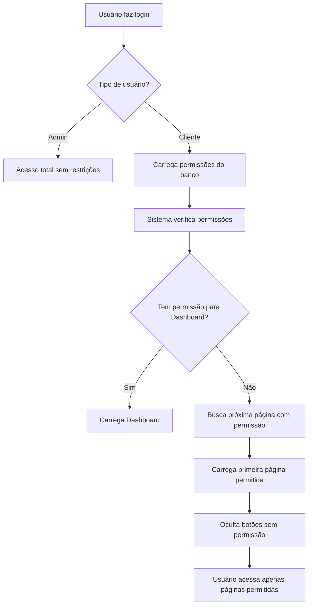

# 🔐 Sistema de Permissões e Restrições

## 📋 Visão Geral

O sistema implementa controle de acesso granular onde o **Administrador** pode restringir quais funcionalidades cada **Cliente** (usuário não-admin) pode acessar.

---

## 👥 Tipos de Usuários

### 🔑 Administrador (tipo: "admin")
- **Acesso Total**: Sem restrições, pode acessar todas as funcionalidades
- **Gerenciamento**: Pode criar, editar e excluir usuários
- **Controle de Permissões**: Define quais permissões cada cliente possui
- **Dados**: Visualiza todos os dados do sistema (multi-tenancy desabilitado)

### 👤 Cliente (tipo: "cliente")
- **Acesso Controlado**: Apenas funcionalidades com permissão concedida
- **Dados Isolados**: Visualiza apenas seus próprios dados (multi-tenancy ativo)
- **Sem Administração**: Não pode acessar painel administrativo
- **Permissões Customizáveis**: Admin define individualmente cada permissão

---

## 🔒 Níveis de Restrição

### 1️⃣ **Bloqueio na Interface (Frontend)**
- **Menu**: Botões sem permissão ficam **ocultos** (`display: none`)
- **Navegação**: Função `showPage()` verifica permissão antes de exibir página
- **Feedback**: Alerta "Você não tem permissão" se tentar acessar página bloqueada
- **Redirecionamento**: Ao fazer login, carrega primeira página com permissão disponível

**Código:**
```javascript
// Ocultar botões sem permissão
function aplicarPermissoesMenu() {
    document.querySelectorAll('[data-permission]').forEach(element => {
        const permission = element.getAttribute('data-permission');
        if (!hasPermission(permission)) {
            element.style.display = 'none'; // Oculta botão
        }
    });
}

// Bloquear acesso a páginas
function showPage(pageName) {
    const requiredPermission = pagePermissions[pageName];
    if (requiredPermission && !hasPermission(requiredPermission)) {
        alert('Você não tem permissão para acessar esta página.');
        return; // Bloqueia navegação
    }
    // ... código de navegação
}
```

---

### 2️⃣ **Bloqueio na API (Backend)**
- **Multi-Tenancy**: Filtro automático por `proprietario_id` para clientes
- **403 Forbidden**: Retorna erro se tentar acessar dados sem permissão
- **Validação de Token**: Middleware verifica autenticação e tipo de usuário
- **Logs de Segurança**: Registra tentativas de acesso não autorizado

**Código:**
```python
# Filtro Multi-Tenancy em database_postgresql.py
if usuario_tipo == 'cliente' and usuario_id:
    query += " WHERE proprietario_id = %s"
    params = [usuario_id]
    print(f"   🔒 Cliente ID {usuario_id}: Apenas dados próprios")
else:
    print("   🔓 Admin: SEM filtros (acesso total)")
```

---

## 📊 Permissões Disponíveis

### **Navegação e Visualização**
| Código da Permissão | Descrição | Páginas Afetadas |
|---------------------|-----------|------------------|
| `Dashboard` | Acesso ao painel principal | Dashboard |
| `Ver Lancamentos` | Visualizar lançamentos financeiros | Contas a Receber, Contas a Pagar, Todos Lançamentos |
| `Ver Clientes` | Visualizar cadastro de clientes | Clientes |
| `Ver Fornecedores` | Visualizar cadastro de fornecedores | Fornecedores |

### **Operações de Lançamentos**
| Código da Permissão | Descrição |
|---------------------|-----------|
| `Criar Lancamento` | Criar novos lançamentos |
| `Editar Lancamento` | Modificar lançamentos existentes |
| `Excluir Lancamento` | Deletar lançamentos |
| `Receber Lancamento` | Marcar lançamento como recebido |
| `Pagar Lancamento` | Marcar lançamento como pago |
| `Parcelar Lancamento` | Criar lançamentos parcelados |

### **Operações de Clientes**
| Código da Permissão | Descrição |
|---------------------|-----------|
| `Criar Cliente` | Adicionar novos clientes |
| `Editar Cliente` | Modificar dados de clientes |
| `Excluir Cliente` | Deletar clientes |
| `Ativar/Desativar Cliente` | Alterar status do cliente |

### **Operações de Fornecedores**
| Código da Permissão | Descrição |
|---------------------|-----------|
| `Criar Fornecedor` | Adicionar novos fornecedores |
| `Editar Fornecedor` | Modificar dados de fornecedores |
| `Excluir Fornecedor` | Deletar fornecedores |
| `Ativar/Desativar Fornecedor` | Alterar status do fornecedor |

### **Operações de Contas Bancárias**
| Código da Permissão | Descrição |
|---------------------|-----------|
| `Criar Conta Bancaria` | Adicionar novas contas |
| `Editar Conta Bancaria` | Modificar dados de contas |
| `Excluir Conta Bancaria` | Deletar contas |
| `Ver Saldo Conta` | Visualizar saldo das contas |

### **Operações de Categorias**
| Código da Permissão | Descrição |
|---------------------|-----------|
| `Criar Categoria` | Adicionar novas categorias |
| `Editar Categoria` | Modificar categorias |
| `Excluir Categoria` | Deletar categorias |

### **Relatórios e Análises**
| Código da Permissão | Descrição |
|---------------------|-----------|
| `Ver Relatorios` | Acessar relatórios gerais |
| `Exportar PDF` | Gerar relatórios em PDF |
| `Exportar Excel` | Gerar relatórios em Excel |

---

## 🎯 Comportamento do Sistema

### **Quando Admin Oculta Dashboard:**

**ANTES (comportamento errado):**
```
Cliente faz login → Carrega Dashboard → Mostra Dashboard (mesmo sem permissão)
```

**AGORA (comportamento correto):**
```
Cliente faz login → Sistema verifica permissões → Dashboard bloqueado
                  → Busca próxima página com permissão
                  → Carrega "Contas a Receber" automaticamente
```

### **Ordem de Prioridade das Páginas:**
1. Dashboard
2. Contas a Receber
3. Contas a Pagar
4. Lançamentos
5. Clientes
6. Fornecedores
7. Categorias
8. Contas Bancárias

O sistema **sempre carrega a primeira página disponível** desta lista que o usuário tenha permissão.

---

## 🛡️ Segurança Implementada

### ✅ **Proteções Ativas**

1. **Bloqueio de Interface**
   - Botões ocultos
   - Navegação bloqueada
   - Alertas de permissão negada

2. **Bloqueio de API**
   - Validação de token
   - Filtro multi-tenancy
   - Retorno 403 Forbidden

3. **Redirecionamento Inteligente**
   - Carrega primeira página permitida
   - Evita tela em branco
   - Feedback claro ao usuário

4. **Logs de Auditoria**
   - Registra acessos bloqueados
   - Identifica tentativas de violação
   - Rastreamento de ações por usuário

---

## 📝 Exemplo de Configuração

### **Usuário "teste" - Operador Financeiro:**
```
✅ Ver Lancamentos (pode ver contas a receber/pagar)
✅ Criar Lancamento (pode criar novos lançamentos)
✅ Editar Lancamento (pode modificar lançamentos)
✅ Receber Lancamento (pode marcar como recebido)
❌ Dashboard (bloqueado)
❌ Ver Clientes (bloqueado)
❌ Excluir Lancamento (bloqueado)
```

**Resultado:**
- Ao fazer login → Carrega "Contas a Receber" automaticamente
- Botão "Dashboard" não aparece no menu
- Pode criar, editar e receber lançamentos
- Não pode excluir ou acessar clientes

---

## 🔧 Manutenção e Troubleshooting

### **Problema: Cliente consegue acessar página sem permissão**
**Solução:**
1. Verificar se `data-permission` está no botão HTML
2. Confirmar que função `showPage()` verifica permissão
3. Checar se API também valida permissão

### **Problema: Menu vazio após login**
**Causa:** Nenhuma permissão concedida
**Solução:** Admin deve conceder pelo menos uma permissão de visualização

### **Problema: Erro 403 na API**
**Causa:** Cliente tentando acessar dados sem permissão
**Solução:** Verificar permissões no painel administrativo

---

## 📌 Boas Práticas

1. **Sempre conceda permissões mínimas**: Dê apenas o necessário para cada usuário
2. **Teste após mudanças**: Faça logout/login para validar alterações
3. **Agrupe permissões lógicas**: Ex: "Ver + Criar + Editar Lançamentos" para operador financeiro
4. **Revise periodicamente**: Remova permissões de usuários inativos
5. **Use logs**: Monitore acessos bloqueados para identificar problemas

---

## 🚀 Fluxo Completo de Acesso



---

**Última atualização:** 11 de Janeiro de 2026
**Versão do Sistema:** PostgreSQL + Pool de Conexões + Sistema de Permissões Granular
