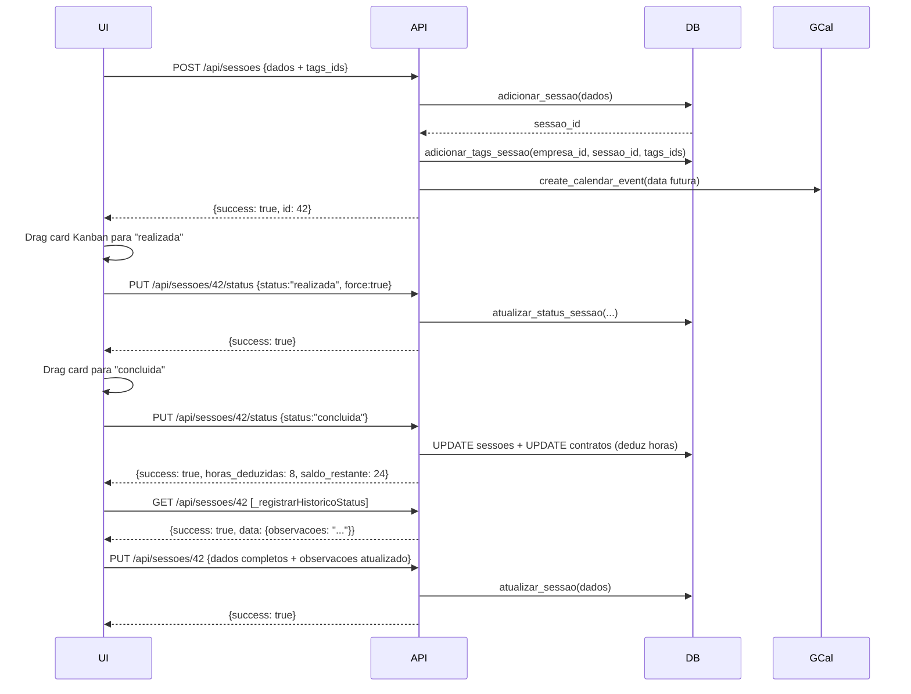

# 📷 Documentação Completa — Módulo de Sessões

**Última atualização:** 2026-01  
**Stack:** Flask + PostgreSQL (Railway) + JavaScript (Kanban / Tabela / Agenda)

---

## 1. Visão Geral

O módulo de **sessões** gerencia sessões de trabalho fotográfico/videográfico, cobrindo todo o ciclo desde o rascunho até a entrega ao cliente. Cada sessão passa por três fases principais com doze status possíveis.

### 1.1 Três Fases da Sessão

```
╔══════════════╗    ╔══════════════════════════════════════════════╗    ╔═══════════════════╗
║  CAPTAÇÃO    ║ →  ║                  EDIÇÃO                      ║ →  ║     ENTREGA       ║
╠══════════════╣    ╠══════════════════════════════════════════════╣    ╠═══════════════════╣
║ • rascunho   ║    ║ • realizada       • tratamento_final         ║    ║ • entrega         ║
║ • agendada   ║    ║ • backup          • alteracao                ║    ║ • concluida ✅    ║
║ • reagendada ║    ║ • tratamento_de_cor                          ║    ║ • arquivada 🗄️   ║
╚══════════════╝    ╚══════════════════════════════════════════════╝    ╚═══════════════════╝
```

Status transversais (não fazem parte de fase): `cancelada`, `arquivada`

---

## 2. Status — Mapa Completo

| ID Status | Label Frontend | Fase | Cor | Oculto no Kanban | Finaliza Ciclo | Gera Histórico |
|---|---|---|---|---|---|---|
| `rascunho` | Rascunho | Captação | `#94a3b8` | Não | Não | Não |
| `agendada` | Agendada | Captação | `#3b82f6` | Não | Não | Não |
| `reagendada` | Reagendada | Captação | `#f97316` | **Sim** | Não | Não |
| `realizada` | Realizada | Edição | `#10b981` | Não | Não | Não |
| `backup` | Backup | Edição | `#0ea5e9` | Não | Não | Não |
| `tratamento_de_cor` | Trat. de Cor | Edição | `#8b5cf6` | Não | Não | Não |
| `tratamento_final` | Trat. Final | Edição | `#7c3aed` | Não | Não | Não |
| `alteracao` | Alteração | Edição | `#f59e0b` | Não | Não | **Sim** |
| `entrega` | Entrega | Entrega | `#14b8a6` | Não | Não | Não |
| `concluida` | Concluída | Entrega | `#059669` | Não | **Sim** | **Sim** |
| `cancelada` | Cancelada | — | `#ef4444` | **Sim** | Não | **Sim** |
| `arquivada` | Arquivadas | — | `#475569` | Não | **Sim** | **Sim** |

### 2.1 Transições de Status Validadas (force=False)

```
cancelada  →  reaberta | agendada
finalizada →  reaberta | cancelada
concluida  →  reaberta | arquivada
arquivada  →  reaberta | concluida
```

Com `force=True` (arrastando no Kanban): qualquer transição é permitida.

---

## 3. Banco de Dados

### 3.1 Tabela `sessoes`

| Coluna | Tipo | Descrição |
|---|---|---|
| `id` | SERIAL PK | Identificador único |
| `empresa_id` | INTEGER | FK — isolamento multi-tenant (RLS) |
| `cliente_id` | INTEGER | FK clientes |
| `contrato_id` | INTEGER | FK contratos |
| `data` | DATE | Data da sessão |
| `endereco` | TEXT | Local/endereço |
| `descricao` | TEXT | Descrição da sessão |
| `prazo_entrega` | DATE | Prazo de entrega do material |
| `observacoes` | TEXT | Observações livres (usado para histórico) |
| `dados_json` | JSONB | Campos extras (ver 3.2) |
| `status` | VARCHAR | Status atual (default: `rascunho`) |
| `duracao` | INTEGER | Duração em **minutos** |
| `numero_nf` | VARCHAR | Número da nota fiscal |
| `horas_trabalhadas` | NUMERIC | Horas confirmadas na finalização |
| `finalizada_em` | TIMESTAMP | Momento da finalização |
| `concluida_em` | TIMESTAMP | Momento da conclusão |
| `google_event_id` | VARCHAR | ID do evento no Google Calendar |
| `created_at` | TIMESTAMP | Criação |
| `updated_at` | TIMESTAMP | Última atualização |

### 3.2 Estrutura do `dados_json`

```json
{
  "horario": "09:00 AS 17:00",
  "quantidade_horas": 8.0,
  "horas_subtrair": 1.0,
  "tipo_foto": true,
  "tipo_video": false,
  "tipo_mobile": false,
  "tags": "casamento,externo",
  "equipe": [
    {
      "nome": "João Silva",
      "funcao": "Fotógrafo",
      "pagamento": 500.0,
      "tipo_pessoa": "func",
      "id_pessoa": 42,
      "pessoa_id": "func_42"
    }
  ],
  "responsaveis": [
    {
      "nome": "Maria Gestora",
      "funcao": "Coordenadora",
      "tipo_pessoa": "func",
      "id_pessoa": 15,
      "pessoa_id": "func_15"
    }
  ],
  "equipamentos": [101, 102],
  "equipamentos_alugados": [
    { "nome": "Tripé 5m", "valor": 150.0, "locadora": "Equipa Bem" }
  ],
  "custos_adicionais": [
    { "descricao": "Transporte", "valor": 80.0, "tipo": "variavel" }
  ]
}
```

### 3.3 Tabela `sessao_tags` (relacional)

```sql
CREATE TABLE sessao_tags (
    sessao_id INTEGER REFERENCES sessoes(id),
    tag_id    INTEGER REFERENCES tags(id)
);
```

---

## 4. API REST — Rotas

**Blueprint:** `sessoes_bp` | **Prefix:** `/api/sessoes`

### 4.1 Lista de Endpoints

| Método | Rota | Permissão | Descrição |
|---|---|---|---|
| GET | `/api/sessoes` | `sessoes_view` | Listar todas as sessões da empresa |
| POST | `/api/sessoes` | `sessoes_edit` | Criar nova sessão |
| GET | `/api/sessoes/<id>` | `sessoes_view` | Buscar sessão específica |
| PUT | `/api/sessoes/<id>` | `sessoes_edit` | Atualizar sessão completa |
| DELETE | `/api/sessoes/<id>` | `sessoes_edit` | Excluir sessão |
| POST | `/api/sessoes/<id>/finalizar` | `sessoes_edit` | Finalizar e deduzir horas do contrato |
| PUT | `/api/sessoes/<id>/status` | `sessoes_edit` | Atualizar apenas o status |
| POST | `/api/sessoes/<id>/cancelar` | `sessoes_edit` | Cancelar sessão |
| POST | `/api/sessoes/<id>/reabrir` | `sessoes_edit` | Reabrir sessão cancelada/finalizada |
| GET | `/api/sessoes/dashboard` | `sessoes_view` | Dados do dashboard (views SQL) |
| GET | `/api/sessoes/estatisticas` | `sessoes_view` | Estatísticas por período |
| GET | `/api/sessoes/comparativo` | `sessoes_view` | Comparativo entre períodos |
| GET | `/api/sessoes/periodo` | `sessoes_view` | Sessões agrupadas por período |
| POST | `/api/sessoes/<id>/gerar-lancamento` | `sessoes_edit` | Gerar lançamento financeiro |
| POST | `/api/sessoes/<id>/estornar-lancamento` | `sessoes_edit` | Estornar lançamento |
| GET | `/api/sessoes/integracao` | `sessoes_view` | Integração sessões × lançamentos |
| GET | `/api/sessoes/analise-financeira` | `sessoes_view` | Análise financeira das sessões |
| PATCH | `/api/sessoes/<id>/configurar-lancamento-automatico` | `sessoes_edit` | Toggle lançamento automático |
| GET | `/api/sessoes/exportar/pdf` | `sessoes_view` | Exportar PDF |

### 4.2 Detalhes dos Endpoints Principais

#### GET `/api/sessoes`

Retorna array de sessões da empresa. Mapeia automaticamente campos do `dados_json` para raiz do objeto.

**Response:** `Array<Sessao>` (200)

Campos extras mapeados na resposta: `horario`, `tipo_foto`, `tipo_video`, `tipo_mobile`, `tags`, `equipe`, `responsaveis`, `equipamentos`, `equipamentos_alugados`, `custos_adicionais`, `quantidade_horas` (convertido de `duracao÷60`).

---

#### GET `/api/sessoes/<id>`

**Response:**
```json
{
  "success": true,
  "data": { <objeto sessao completo> }
}
```

> ⚠️ A chave do objeto é `data`, não `sessao`.

---

#### POST `/api/sessoes`

**Body:**
```json
{
  "cliente_id": 10,
  "contrato_id": 5,
  "data": "2026-02-15",
  "horario": "09:00 AS 18:00",
  "quantidade_horas": 8,
  "horas_subtrair": 1,
  "endereco": "Rua das Flores, 100",
  "tipo_foto": true,
  "tipo_video": false,
  "tipo_mobile": false,
  "descricao": "Ensaio externo",
  "prazo_entrega": "2026-02-28",
  "equipe": [
    { "pessoa_id": "func_42", "tipo_pessoa": "func", "id_pessoa": 42, "funcao": "Fotógrafo", "pagamento": 500 }
  ],
  "responsaveis": [],
  "equipamentos": [101],
  "equipamentos_alugados": [],
  "custos_adicionais": [],
  "tags_ids": [3, 7],
  "observacoes": "",
  "status": "agendada"
}
```

**Response (201):**
```json
{ "success": true, "message": "Sessão criada com sucesso", "id": 42 }
```

> **Nota:** `duracao` no banco = `quantidade_horas × 60` (minutos). `tags_ids` são salvas separadamente na tabela `sessao_tags`.

---

#### PUT `/api/sessoes/<id>`

> ⚠️ **Update COMPLETO** — todos os campos da sessão são sobrescritos. Nunca enviar objetos parciais. Campos ausentes viram NULL no banco.

**Body:** mesmo esquema do POST, obrigatoriamente com todos os campos.

---

#### PUT `/api/sessoes/<id>/status`

**Body:**
```json
{ "status": "realizada", "force": false }
```
`force: true` pula validação de transição (usado pelo Kanban).

---

#### POST `/api/sessoes/<id>/cancelar`

**Body:**
```json
{ "motivo": "Cliente desmarcou" }
```

Cancela a sessão e appenda motivo em `observacoes`.

---

## 5. Frontend — Arquitetura

### 5.1 Ficheiros

| Arquivo | Responsabilidade |
|---|---|
| `static/app.js` | Kanban, tabela, filtros, `loadSessoes`, `editarSessao`, `_registrarHistoricoStatus` |
| `static/modals.js` | Modal de criação/edição (`openModalSessao`, `salvarSessao`), `_onStatusSelectChange` |
| `static/contratos.js` | `atualizarStatusSessao`, `getLabelStatusSessao`, `getCorStatusSessao` |
| `static/agenda_calendar.js` | FullCalendar, popover ao clicar no evento |

### 5.2 Ordem de Carregamento

```
app.js → contratos.js → modals.js
```

---

## 6. Kanban

### 6.1 Configuração de Colunas

Definida em `DEFAULT_KANBAN_COLS` (app.js). Persistida em `localStorage` com chave `sessoes_kanban_cols_v4`.

Atributos por coluna:
- `id` — valor do campo `status`
- `label` — texto exibido
- `cor` — cor hex do header
- `final` — coluna final (sessão não pode avançar)
- `hidden` — oculta por padrão (ex: `reagendada`, `cancelada`)
- `archived` — coluna de arquivamento
- `gera_historico` — ao mover para esta coluna, appenda entrada em `observacoes`
- `historico_descricao` — texto padrão do histórico

### 6.2 Colunas Ocultas por Padrão

- `reagendada` — exibida ao clicar em "Mostrar Ocultas"
- `cancelada` — idem

### 6.3 Arrastar e Soltar (onKanbanDrop)

1. Chama `PUT /api/sessoes/<id>/status` com `force: true`
2. Se `colDef.gera_historico === true`, chama `_registrarHistoricoStatus(id, status, descricao)`
3. Atualiza card visual imediatamente (otimistic UI)

---

## 7. Alertas de Prazo (`_calcPrazoAlerta`)

Calcula cor e badge de alerta por **fase** da sessão:

| Fase | Referência de Data | Alerta |
|---|---|---|
| Captação (rascunho/agendada/reagendada) | `sessao.data` | Vermelho (vencida), Laranja (amanhã), Amarelo (≤3 dias) |
| Edição (realizada/backup/trat_cor/trat_final/alteracao) | `prazo_entrega` | Idem |
| Entrega (entrega/concluida) | — | Sem alerta (verde) |
| cancelada / arquivada | — | Sem alerta |

---

## 8. Modal de Criação/Edição

### 8.1 Estrutura (`openModalSessao` em modals.js)

- Campo `<input type="hidden" id="sessao-id">` — ID da sessão em edição
- Seção **"Status da Sessão"**:
  - `#sessao-status-badge-preview` — pill colorido atualizado em tempo real
  - `#sessao-status-select` — dropdown agrupado (Captação / Edição / Entrega)
  - `#sessao-status` (hidden input) — valor enviado no `salvarSessao`
- `setTimeout(110ms)` — sincroniza select + badge ao valor inicial

### 8.2 Mudança de Status no Modal (`_onStatusSelectChange`)

1. Atualiza `#sessao-status` (hidden)
2. Atualiza badge visual
3. Se sessão já existe (edição): chama imediatamente `PUT /api/sessoes/<id>/status`
4. Exibe notificação de sucesso/erro

### 8.3 `salvarSessao`

- Lê `sessao-status` com `event.target.querySelector('#sessao-id')` para evitar conflito com campo estático `#modal-sessao` legado
- Envia `tags_ids` como array de inteiros
- `quantidade_horas` = `#sessao-horas-liquidas` (horas brutas - pausa) ou fallback `#sessao-horas`
- `PUT` atualiza TODOS os campos (update completo)
- Após sucesso: `closeModal()` + `loadSessoes()` + `refreshAgendaFotografia()`

---

## 9. Histórico por Status (`_registrarHistoricoStatus`)

Chamada pelo Kanban quando a coluna de destino tem `gera_historico: true`.

**Fluxo:**
1. `GET /api/sessoes/<id>` → extrai `data.data` (objeto sessão completo)
2. Cria entrada: `[DD/MM/YYYY HH:MM] <descricao>`
3. `PUT /api/sessoes/<id>` com TODOS os dados da sessão + observacoes acumuladas

> ⚠️ Usa o objeto completo para não nulificar outros campos (PUT é update total).

---

## 10. Integração Financeira

### 10.1 Gerar Lançamento

`POST /api/sessoes/<id>/gerar-lancamento` → chama SQL `gerar_lancamento_sessao(sessao_id, usuario_id)`

### 10.2 Estornar Lançamento

`POST /api/sessoes/<id>/estornar-lancamento` → chama SQL `estornar_lancamento_sessao(sessao_id, deletar_bool)`

### 10.3 Lançamento Automático

Coluna `gerar_lancamento_automatico` na tabela sessões. Toggleável via `PATCH /api/sessoes/<id>/configurar-lancamento-automatico`.

---

## 11. Integração Google Calendar

Gerenciada em `_sync_sessao_google()` (sessoes.py).

**Comportamento:**
- Sessões com data no **passado** são ignoradas (sem erro)
- Controla convites via `db.registrar_gcal_convites` / `db.get_emails_ja_convidados_gcal` — evita reenvio
- Token expirado: retorna `google_calendar_token_expired: true` na resposta
- Cria evento na criação da sessão
- Atualiza evento no `PUT`
- Attendees = equipe (funcionários + fornecedores com e-mail cadastrado)

---

## 12. Controle de Horas no Contrato

### 12.1 `_sincronizar_horas_contrato(contrato_id, empresa_id)`

Recalcula `contratos.horas_utilizadas` somando `duracao` de todas as sessões não canceladas vinculadas ao contrato.

Chamado automaticamente em:
- Criação de sessão (`POST`)
- Exclusão de sessão (`DELETE`)
- Finalização de sessão

### 12.2 Dedução automática ao concluir (`atualizar_status_sessao`)

Quando status muda para `concluida` e o contrato tem `controle_horas_ativo = true`:
- Deduz `quantidade_horas` de `contratos.horas_utilizadas`
- Gera `horas_extras` se saldo insuficiente
- Retorna na resposta: `horas_deduzidas`, `horas_extras`, `saldo_restante`

---

## 13. Segurança

| Mecanismo | Onde |
|---|---|
| RLS via `SET app.current_empresa_id` | `get_db_connection(empresa_id=...)` em todas as operações |
| `@require_permission('sessoes_view')` | Rotas de leitura |
| `@require_permission('sessoes_edit')` | Rotas de escrita |
| `filtrar_por_cliente` | GET lista — restringe por cliente do usuário |
| `empresa_id` no WHERE do UPDATE | `atualizar_sessao`: `WHERE id=%s AND empresa_id=%s` |
| `empresa_id` no WHERE do SELECT | `buscar_sessao`: `WHERE s.id=%s AND s.empresa_id=%s` |
| Validação de `tags_ids` (deve ser lista) | `POST /api/sessoes` antes de chamar `adicionar_tags_sessao` |

---

## 14. Mapeamento Frontend ↔ Backend

| Campo no Frontend | Campo no Banco | Conversão |
|---|---|---|
| `data` | `sessoes.data` | ISO string → DATE |
| `quantidade_horas` | `dados_json.quantidade_horas` | float |
| `duracao` | `sessoes.duracao` | `quantidade_horas × 60` (minutos) |
| `horas_subtrair` | `dados_json.horas_subtrair` | float |
| `tipo_foto/video/mobile` | `dados_json.tipo_foto/video/mobile` | bool |
| `tags_ids` (array int) | tabela `sessao_tags` | via `adicionar_tags_sessao()` |
| `tags` (string legado) | `dados_json.tags` | string livre |
| `equipe[].pessoa_id` | `dados_json.equipe[].pessoa_id` | `"func_42"` / `"forn_7"` |
| `status` | `sessoes.status` | string enum |
| `prazo_entrega` | `sessoes.prazo_entrega` | ISO string → DATE |

---

## 15. Views e Funções SQL Utilizadas

| Objeto | Tipo | Endpoint |
|---|---|---|
| `vw_sessoes_estatisticas` | VIEW | `/dashboard` |
| `vw_top_clientes_sessoes` | VIEW | `/dashboard` |
| `vw_sessoes_atencao` | VIEW | `/dashboard` |
| `vw_sessoes_por_periodo` | VIEW | `/periodo` |
| `vw_sessoes_lancamentos` | VIEW | `/integracao` |
| `vw_sessoes_financeiro` | VIEW | `/analise-financeira` |
| `obter_estatisticas_periodo(emp, ini, fim)` | FUNCTION | `/estatisticas` |
| `comparativo_periodos(...)` | FUNCTION | `/comparativo` |
| `gerar_lancamento_sessao(sessao_id, user_id)` | FUNCTION | `/gerar-lancamento` |
| `estornar_lancamento_sessao(sessao_id, deletar)` | FUNCTION | `/estornar-lancamento` |

---

## 16. Bugs Conhecidos e Corrigidos

| # | Descrição | Arquivo | Status | Commit |
|---|---|---|---|---|
| 1 | `getCorStatusSessao` cores erradas | contratos.js | ✅ Corrigido | a01e491 |
| 2 | `atualizarStatusSessao` opções incorretas no dropdown | contratos.js | ✅ Corrigido | a01e491 |
| 3 | `sessFin` ignorava `entrega`/`arquivada` | app.js | ✅ Corrigido | a01e491 |
| 4 | `data_sessao` usado em vez de `data` (5 locais) | contratos.js | ✅ Corrigido | b571e5f |
| 5 | Status bruto exibido sem label legível (5 locais) | contratos.js | ✅ Corrigido | b571e5f |
| 6 | `_registrarHistoricoStatus` enviava só `{observacoes}` no PUT → nulificava outros campos | app.js | ✅ Corrigido | d1dff4d |
| 7 | Botão toggle dentro do flex board (layout quebrado) | app.js | ✅ Corrigido | d1dff4d |
| 8 | `_hiddenCount` não contava canceladas | app.js | ✅ Corrigido | d1dff4d |
| 9 | `getElementById('sessao-id')` pegava campo legado do modal estático | modals.js | ✅ Corrigido | d1dff4d |
| 10 | `_registrarHistoricoStatus` usava `data.sessao` mas API retorna `data.data` → objeto errado | app.js | ✅ **Corrigido** | atual |
| 11 | `buscar_sessao` sem filtro `empresa_id` no WHERE → vazamento entre empresas | database_postgresql.py | ✅ **Corrigido** | atual |
| 12 | `atualizar_sessao` sem filtro `empresa_id` no WHERE → sobrescrita entre empresas | database_postgresql.py | ✅ **Corrigido** | atual |
| 13 | `tags_ids` do frontend nunca salvo em `sessao_tags` no POST | sessoes.py + database_postgresql.py | ✅ **Corrigido** | atual |

---

## 17. Fluxo Típico de uma Sessão



---

## 18. Variáveis e Funções Chave no Frontend

| Símbolo | Arquivo | Linha aprox. | Descrição |
|---|---|---|---|
| `KANBAN_LS_KEY` | app.js | ~5600 | `'sessoes_kanban_cols_v4'` |
| `DEFAULT_KANBAN_COLS` | app.js | ~5600 | Array de configuração das colunas |
| `_todasSessoesCache` | app.js | — | Cache de todas as sessões carregadas |
| `loadSessoes()` | app.js | 5333 | Carrega sessões via GET e renderiza |
| `renderKanban()` | app.js | ~5602 | Renderiza quadro Kanban |
| `renderKanbanCard()` | app.js | ~5772 | Renderiza um card do Kanban |
| `onKanbanDrop()` | app.js | ~5893 | Handler de drag-and-drop |
| `_calcPrazoAlerta()` | app.js | ~5430 | Calcula alerta de prazo por fase |
| `toggleKanbanColsOcultas()` | app.js | ~5762 | Mostra/oculta colunas hidden |
| `_registrarHistoricoStatus()` | app.js | ~5978 | Appenda histórico nas observações |
| `editarSessao(id)` | app.js | 7183 | Abre modal com dados da sessão |
| `duplicarSessao(id)` | app.js | ~7215 | Duplica sessão como rascunho |
| `excluirSessao(id)` | app.js | ~7250 | Exclui sessão com confirmação |
| `openModalSessao(sessaoEdit)` | modals.js | — | Abre modal de criação/edição |
| `salvarSessao(event)` | modals.js | 3792 | Submete formulário da sessão |
| `_onStatusSelectChange(el)` | modals.js | — | Atualiza status imediatamente |
| `_calcularHorasSessao()` | modals.js | 4203 | Calcula horas brutas e líquidas |
| `atualizarStatusSessao(id)` | contratos.js | 1302 | Modal de mudança de status |
| `getLabelStatusSessao(s)` | contratos.js | — | Label legível de status |
| `getCorStatusSessao(s)` | contratos.js | — | Cor hex por status |
