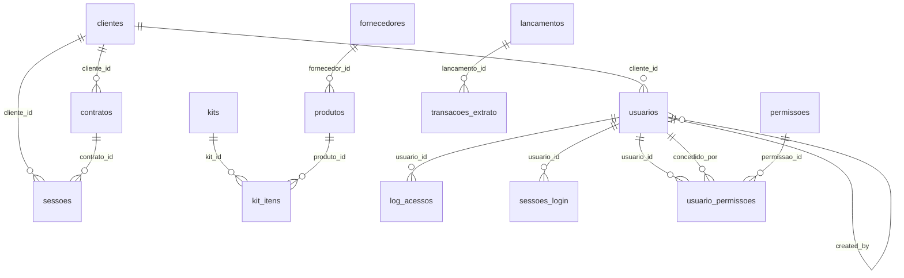

# 📊 Schema do Banco de Dados - Sistema Financeiro

**Data de Extração**: 20/01/2026 às 15:45  
**Database**: PostgreSQL (Railway)  
**Total de Tabelas**: 18

---

## 📋 Índice Geral

1. **[agenda](#agenda)** (10 colunas, 0 FKs)
2. **[categorias](#categorias)** (9 colunas, 0 FKs)
3. **[clientes](#clientes)** (9 colunas, 0 FKs)
4. **[contas_bancarias](#contas_bancarias)** (12 colunas, 0 FKs)
5. **[contratos](#contratos)** (10 colunas, 1 FK)
6. **[fornecedores](#fornecedores)** (9 colunas, 0 FKs)
7. **[kit_itens](#kit_itens)** (5 colunas, 2 FKs)
8. **[kits](#kits)** (7 colunas, 0 FKs)
9. **[lancamentos](#lancamentos)** (22 colunas, 0 FKs)
10. **[log_acessos](#log_acessos)** (7 colunas, 1 FK)
11. **[permissoes](#permissoes)** (6 colunas, 0 FKs)
12. **[produtos](#produtos)** (11 colunas, 1 FK)
13. **[sessoes](#sessoes)** (10 colunas, 2 FKs)
14. **[sessoes_login](#sessoes_login)** (9 colunas, 1 FK)
15. **[tags](#tags)** (5 colunas, 0 FKs)
16. **[templates_equipe](#templates_equipe)** (5 colunas, 0 FKs)
17. **[transacoes_extrato](#transacoes_extrato)** (16 colunas, 1 FK)
18. **[usuario_permissoes](#usuario_permissoes)** (6 colunas, 3 FKs)
19. **[usuarios](#usuarios)** (13 colunas, 2 FKs)

---

## 📈 Estatísticas Gerais

- 📊 **Total de Tabelas**: 19
- 📊 **Total de Colunas**: ~180
- 🔗 **Total de Foreign Keys**: 14
- 📇 **Indexes**: Múltiplos em transacoes_extrato
- 🔐 **Constraints**: CHECK constraints em múltiplas tabelas

### 🏆 Top 5 Tabelas Mais Complexas

1. `lancamentos` - 22 colunas (sistema central de lançamentos financeiros)
2. `transacoes_extrato` - 16 colunas (importação OFX)
3. `usuarios` - 13 colunas (autenticação e autorização)
4. `contas_bancarias` - 12 colunas (contas do sistema)
5. `produtos` - 11 colunas (gestão de produtos)

---

## 📦 `agenda`

**📊 Estatísticas**:
- Colunas: 10
- Primary Key: `id`
- Foreign Keys: 0
- Purpose: Gerenciar eventos e compromissos

### 📋 Colunas

| # | Coluna | Tipo | Nullable | Default | Observações |
|---|--------|------|----------|---------|-------------|
| 1 | **`id`** | SERIAL | ❌ | - | 🔑 PK |
| 2 | **`titulo`** | VARCHAR(255) | ❌ | - | - |
| 3 | **`data_evento`** | DATE | ❌ | - | - |
| 4 | **`hora_inicio`** | TIME | ✅ | - | - |
| 5 | **`hora_fim`** | TIME | ✅ | - | - |
| 6 | **`local`** | VARCHAR(255) | ✅ | - | - |
| 7 | **`tipo`** | VARCHAR(50) | ✅ | - | - |
| 8 | **`status`** | VARCHAR(50) | ✅ | 'agendado' | - |
| 9 | **`observacoes`** | TEXT | ✅ | - | - |
| 10 | **`created_at`** | TIMESTAMP | ✅ | CURRENT_TIMESTAMP | - |
| 11 | **`updated_at`** | TIMESTAMP | ✅ | CURRENT_TIMESTAMP | - |

---

## 📦 `categorias`

**📊 Estatísticas**:
- Colunas: 9
- Primary Key: `id`
- Foreign Keys: 0
- Constraint: UNIQUE em `nome`
- Purpose: Categorizar lançamentos (receitas/despesas)

### 📋 Colunas

| # | Coluna | Tipo | Nullable | Default | Observações |
|---|--------|------|----------|---------|-------------|
| 1 | **`id`** | SERIAL | ❌ | - | 🔑 PK |
| 2 | **`nome`** | VARCHAR(255) | ❌ | - | 🔒 UNIQUE |
| 3 | **`tipo`** | VARCHAR(50) | ❌ | - | receita/despesa |
| 4 | **`subcategorias`** | TEXT | ✅ | - | JSON serializado |
| 5 | **`cor`** | VARCHAR(7) | ✅ | - | Hex color |
| 6 | **`icone`** | VARCHAR(50) | ✅ | - | CSS class |
| 7 | **`descricao`** | TEXT | ✅ | - | - |
| 8 | **`created_at`** | TIMESTAMP | ✅ | CURRENT_TIMESTAMP | - |
| 9 | **`updated_at`** | TIMESTAMP | ✅ | CURRENT_TIMESTAMP | - |

---

## 📦 `clientes`

**📊 Estatísticas**:
- Colunas: 9
- Primary Key: `id`
- Foreign Keys: 0
- Constraint: UNIQUE em `cpf_cnpj`
- Purpose: Cadastro de clientes

### 📋 Colunas

| # | Coluna | Tipo | Nullable | Default | Observações |
|---|--------|------|----------|---------|-------------|
| 1 | **`id`** | SERIAL | ❌ | - | 🔑 PK |
| 2 | **`nome`** | VARCHAR(255) | ❌ | - | - |
| 3 | **`cpf_cnpj`** | VARCHAR(18) | ✅ | - | 🔒 UNIQUE |
| 4 | **`email`** | VARCHAR(255) | ✅ | - | - |
| 5 | **`telefone`** | VARCHAR(20) | ✅ | - | - |
| 6 | **`endereco`** | TEXT | ✅ | - | - |
| 7 | **`ativo`** | BOOLEAN | ✅ | TRUE | - |
| 8 | **`created_at`** | TIMESTAMP | ✅ | CURRENT_TIMESTAMP | - |
| 9 | **`updated_at`** | TIMESTAMP | ✅ | CURRENT_TIMESTAMP | - |

---

## 📦 `contas_bancarias`

**📊 Estatísticas**:
- Colunas: 12
- Primary Key: `id`
- Foreign Keys: 0
- Constraint: UNIQUE em `nome`, CHECK em `tipo_saldo_inicial`
- Purpose: Gestão de contas bancárias

### 📋 Colunas

| # | Coluna | Tipo | Nullable | Default | Observações |
|---|--------|------|----------|---------|-------------|
| 1 | **`id`** | SERIAL | ❌ | - | 🔑 PK |
| 2 | **`nome`** | VARCHAR(255) | ❌ | - | 🔒 UNIQUE |
| 3 | **`banco`** | VARCHAR(255) | ❌ | - | - |
| 4 | **`agencia`** | VARCHAR(50) | ❌ | - | - |
| 5 | **`conta`** | VARCHAR(50) | ❌ | - | - |
| 6 | **`saldo_inicial`** | DECIMAL(15,2) | ❌ | - | - |
| 7 | **`tipo_saldo_inicial`** | VARCHAR(10) | ✅ | 'credor' | ✔️ CHECK: credor/devedor |
| 8 | **`data_inicio`** | DATE | ❌ | - | - |
| 9 | **`ativa`** | BOOLEAN | ✅ | TRUE | - |
| 10 | **`data_criacao`** | TIMESTAMP | ❌ | - | - |
| 11 | **`created_at`** | TIMESTAMP | ✅ | CURRENT_TIMESTAMP | - |
| 12 | **`updated_at`** | TIMESTAMP | ✅ | CURRENT_TIMESTAMP | - |

---

## 📦 `contratos`

**📊 Estatísticas**:
- Colunas: 10
- Primary Key: `id`
- Foreign Keys: 1 (`cliente_id`)
- Constraint: UNIQUE em `numero`
- Purpose: Gestão de contratos com clientes

### 📋 Colunas

| # | Coluna | Tipo | Nullable | Default | Observações |
|---|--------|------|----------|---------|-------------|
| 1 | **`id`** | SERIAL | ❌ | - | 🔑 PK |
| 2 | **`numero`** | VARCHAR(100) | ❌ | - | 🔒 UNIQUE |
| 3 | **`cliente_id`** | INTEGER | ✅ | - | 🔗 FK → `clientes.id` |
| 4 | **`descricao`** | TEXT | ❌ | - | - |
| 5 | **`valor`** | DECIMAL(15,2) | ❌ | - | - |
| 6 | **`data_inicio`** | DATE | ❌ | - | - |
| 7 | **`data_fim`** | DATE | ✅ | - | - |
| 8 | **`status`** | VARCHAR(50) | ✅ | 'ativo' | - |
| 9 | **`observacoes`** | TEXT | ✅ | - | - |
| 10 | **`created_at`** | TIMESTAMP | ✅ | CURRENT_TIMESTAMP | - |
| 11 | **`updated_at`** | TIMESTAMP | ✅ | CURRENT_TIMESTAMP | - |

---

## 📦 `fornecedores`

**📊 Estatísticas**:
- Colunas: 9
- Primary Key: `id`
- Foreign Keys: 0
- Constraint: UNIQUE em `cpf_cnpj`
- Purpose: Cadastro de fornecedores

### 📋 Colunas

| # | Coluna | Tipo | Nullable | Default | Observações |
|---|--------|------|----------|---------|-------------|
| 1 | **`id`** | SERIAL | ❌ | - | 🔑 PK |
| 2 | **`nome`** | VARCHAR(255) | ❌ | - | - |
| 3 | **`cpf_cnpj`** | VARCHAR(18) | ✅ | - | 🔒 UNIQUE |
| 4 | **`email`** | VARCHAR(255) | ✅ | - | - |
| 5 | **`telefone`** | VARCHAR(20) | ✅ | - | - |
| 6 | **`endereco`** | TEXT | ✅ | - | - |
| 7 | **`ativo`** | BOOLEAN | ✅ | TRUE | - |
| 8 | **`created_at`** | TIMESTAMP | ✅ | CURRENT_TIMESTAMP | - |
| 9 | **`updated_at`** | TIMESTAMP | ✅ | CURRENT_TIMESTAMP | - |

---

## 📦 `kit_itens`

**📊 Estatísticas**:
- Colunas: 5
- Primary Key: `id`
- Foreign Keys: 2 (`kit_id`, `produto_id`)
- Purpose: Relacionamento N:N entre kits e produtos

### 📋 Colunas

| # | Coluna | Tipo | Nullable | Default | Observações |
|---|--------|------|----------|---------|-------------|
| 1 | **`id`** | SERIAL | ❌ | - | 🔑 PK |
| 2 | **`kit_id`** | INTEGER | ❌ | - | 🔗 FK → `kits.id` ON DELETE CASCADE |
| 3 | **`produto_id`** | INTEGER | ✅ | - | 🔗 FK → `produtos.id` |
| 4 | **`quantidade`** | DECIMAL(15,3) | ❌ | - | - |
| 5 | **`created_at`** | TIMESTAMP | ✅ | CURRENT_TIMESTAMP | - |

---

## 📦 `kits`

**📊 Estatísticas**:
- Colunas: 7
- Primary Key: `id`
- Foreign Keys: 0
- Constraint: UNIQUE em `codigo`
- Purpose: Kits de equipamentos/produtos
- **⚠️ Inconsistência**: Código usa campos `descricao` e `empresa_id` que não existem no CREATE TABLE

### 📋 Colunas

| # | Coluna | Tipo | Nullable | Default | Observações |
|---|--------|------|----------|---------|-------------|
| 1 | **`id`** | SERIAL | ❌ | - | 🔑 PK |
| 2 | **`codigo`** | VARCHAR(100) | ❌ | - | 🔒 UNIQUE |
| 3 | **`nome`** | VARCHAR(255) | ❌ | - | - |
| 4 | **`preco`** | DECIMAL(15,2) | ❌ | - | - |
| 5 | **`observacoes`** | TEXT | ✅ | - | ⚠️ Código usa `descricao` |
| 6 | **`created_at`** | TIMESTAMP | ✅ | CURRENT_TIMESTAMP | - |
| 7 | **`updated_at`** | TIMESTAMP | ✅ | CURRENT_TIMESTAMP | - |

### ⚠️ Problemas Identificados:
1. **Coluna faltante**: `descricao` - usado em [app/routes/kits.py](app/routes/kits.py#L57)
2. **Coluna faltante**: `empresa_id` - usado em [app/routes/kits.py](app/routes/kits.py#L124)

---

## 📦 `lancamentos`

**📊 Estatísticas**:
- Colunas: 22 (tabela mais complexa)
- Primary Key: `id`
- Foreign Keys: 0
- Purpose: Sistema central de lançamentos financeiros (receitas/despesas)

### 📋 Colunas

| # | Coluna | Tipo | Nullable | Default | Observações |
|---|--------|------|----------|---------|-------------|
| 1 | **`id`** | SERIAL | ❌ | - | 🔑 PK |
| 2 | **`tipo`** | VARCHAR(50) | ❌ | - | receita/despesa |
| 3 | **`descricao`** | TEXT | ❌ | - | - |
| 4 | **`valor`** | DECIMAL(15,2) | ❌ | - | - |
| 5 | **`data_vencimento`** | DATE | ❌ | - | - |
| 6 | **`data_pagamento`** | DATE | ✅ | - | - |
| 7 | **`categoria`** | VARCHAR(255) | ✅ | - | - |
| 8 | **`subcategoria`** | VARCHAR(255) | ✅ | - | - |
| 9 | **`conta_bancaria`** | VARCHAR(255) | ✅ | - | - |
| 10 | **`cliente_fornecedor`** | VARCHAR(255) | ✅ | - | - |
| 11 | **`pessoa`** | VARCHAR(255) | ✅ | - | - |
| 12 | **`status`** | VARCHAR(50) | ❌ | - | pendente/pago/cancelado |
| 13 | **`observacoes`** | TEXT | ✅ | - | - |
| 14 | **`anexo`** | TEXT | ✅ | - | caminho do arquivo |
| 15 | **`recorrente`** | BOOLEAN | ✅ | FALSE | - |
| 16 | **`frequencia_recorrencia`** | VARCHAR(50) | ✅ | - | mensal/anual/etc |
| 17 | **`dia_vencimento`** | INTEGER | ✅ | - | - |
| 18 | **`juros`** | DECIMAL(15,2) | ✅ | 0 | Adicionado via migration |
| 19 | **`desconto`** | DECIMAL(15,2) | ✅ | 0 | Adicionado via migration |
| 20 | **`created_at`** | TIMESTAMP | ✅ | CURRENT_TIMESTAMP | - |
| 21 | **`updated_at`** | TIMESTAMP | ✅ | CURRENT_TIMESTAMP | - |

---

## 📦 `log_acessos`

**📊 Estatísticas**:
- Colunas: 7
- Primary Key: `id`
- Foreign Keys: 1 (`usuario_id`)
- Purpose: Auditoria de ações dos usuários

### 📋 Colunas

| # | Coluna | Tipo | Nullable | Default | Observações |
|---|--------|------|----------|---------|-------------|
| 1 | **`id`** | SERIAL | ❌ | - | 🔑 PK |
| 2 | **`usuario_id`** | INTEGER | ✅ | - | 🔗 FK → `usuarios.id` |
| 3 | **`acao`** | VARCHAR(100) | ❌ | - | - |
| 4 | **`descricao`** | TEXT | ✅ | - | - |
| 5 | **`ip_address`** | VARCHAR(45) | ✅ | - | IPv4/IPv6 |
| 6 | **`sucesso`** | BOOLEAN | ✅ | TRUE | - |
| 7 | **`timestamp`** | TIMESTAMP | ✅ | CURRENT_TIMESTAMP | - |

---

## 📦 `permissoes`

**📊 Estatísticas**:
- Colunas: 6
- Primary Key: `id`
- Foreign Keys: 0
- Constraint: UNIQUE em `codigo`
- Purpose: Definir funcionalidades do sistema

### 📋 Colunas

| # | Coluna | Tipo | Nullable | Default | Observações |
|---|--------|------|----------|---------|-------------|
| 1 | **`id`** | SERIAL | ❌ | - | 🔑 PK |
| 2 | **`codigo`** | VARCHAR(50) | ❌ | - | 🔒 UNIQUE |
| 3 | **`nome`** | VARCHAR(100) | ❌ | - | - |
| 4 | **`descricao`** | TEXT | ✅ | - | - |
| 5 | **`categoria`** | VARCHAR(50) | ✅ | - | - |
| 6 | **`ativo`** | BOOLEAN | ✅ | TRUE | - |

---

## 📦 `produtos`

**📊 Estatísticas**:
- Colunas: 11
- Primary Key: `id`
- Foreign Keys: 1 (`fornecedor_id`)
- Constraint: UNIQUE em `codigo`
- Purpose: Catálogo de produtos

### 📋 Colunas

| # | Coluna | Tipo | Nullable | Default | Observações |
|---|--------|------|----------|---------|-------------|
| 1 | **`id`** | SERIAL | ❌ | - | 🔑 PK |
| 2 | **`codigo`** | VARCHAR(100) | ❌ | - | 🔒 UNIQUE |
| 3 | **`nome`** | VARCHAR(255) | ❌ | - | - |
| 4 | **`categoria`** | VARCHAR(100) | ✅ | - | - |
| 5 | **`quantidade`** | DECIMAL(15,3) | ✅ | 0 | Estoque |
| 6 | **`preco_custo`** | DECIMAL(15,2) | ✅ | - | - |
| 7 | **`preco_venda`** | DECIMAL(15,2) | ✅ | - | - |
| 8 | **`fornecedor_id`** | INTEGER | ✅ | - | 🔗 FK → `fornecedores.id` |
| 9 | **`observacoes`** | TEXT | ✅ | - | - |
| 10 | **`created_at`** | TIMESTAMP | ✅ | CURRENT_TIMESTAMP | - |
| 11 | **`updated_at`** | TIMESTAMP | ✅ | CURRENT_TIMESTAMP | - |

---

## 📦 `sessoes`

**📊 Estatísticas**:
- Colunas: 10
- Primary Key: `id`
- Foreign Keys: 2 (`contrato_id`, `cliente_id`)
- Purpose: Sessões de trabalho vinculadas a contratos
- **⚠️ Inconsistência**: Frontend usa campos diferentes do backend

### 📋 Colunas

| # | Coluna | Tipo | Nullable | Default | Observações |
|---|--------|------|----------|---------|-------------|
| 1 | **`id`** | SERIAL | ❌ | - | 🔑 PK |
| 2 | **`titulo`** | VARCHAR(255) | ❌ | - | - |
| 3 | **`data_sessao`** | DATE | ❌ | - | ⚠️ Frontend usa `data` |
| 4 | **`duracao`** | INTEGER | ✅ | - | minutos - ⚠️ Frontend usa `quantidade_horas` |
| 5 | **`contrato_id`** | INTEGER | ✅ | - | 🔗 FK → `contratos.id` |
| 6 | **`cliente_id`** | INTEGER | ✅ | - | 🔗 FK → `clientes.id` |
| 7 | **`valor`** | DECIMAL(15,2) | ✅ | - | - |
| 8 | **`observacoes`** | TEXT | ✅ | - | - |
| 9 | **`created_at`** | TIMESTAMP | ✅ | CURRENT_TIMESTAMP | - |
| 10 | **`updated_at`** | TIMESTAMP | ✅ | CURRENT_TIMESTAMP | - |

### ⚠️ Problemas Identificados:
1. **Mapeamento inconsistente**: Frontend envia `data` mas backend espera `data_sessao`
2. **Mapeamento inconsistente**: Frontend envia `horario` mas backend não tem esse campo
3. **Mapeamento inconsistente**: Frontend envia `quantidade_horas` mas backend espera `duracao`

---

## 📦 `sessoes_login`

**📊 Estatísticas**:
- Colunas: 9
- Primary Key: `id`
- Foreign Keys: 1 (`usuario_id`)
- Constraint: UNIQUE em `session_token`
- Purpose: Gerenciar sessões ativas de usuários

### 📋 Colunas

| # | Coluna | Tipo | Nullable | Default | Observações |
|---|--------|------|----------|---------|-------------|
| 1 | **`id`** | SERIAL | ❌ | - | 🔑 PK |
| 2 | **`usuario_id`** | INTEGER | ✅ | - | 🔗 FK → `usuarios.id` ON DELETE CASCADE |
| 3 | **`session_token`** | VARCHAR(255) | ❌ | - | 🔒 UNIQUE |
| 4 | **`ip_address`** | VARCHAR(45) | ✅ | - | IPv4/IPv6 |
| 5 | **`user_agent`** | TEXT | ✅ | - | Browser info |
| 6 | **`criado_em`** | TIMESTAMP | ✅ | CURRENT_TIMESTAMP | - |
| 7 | **`expira_em`** | TIMESTAMP | ❌ | - | - |
| 8 | **`ativo`** | BOOLEAN | ✅ | TRUE | - |

---

## 📦 `tags`

**📊 Estatísticas**:
- Colunas: 5
- Primary Key: `id`
- Foreign Keys: 0
- Constraint: UNIQUE em `nome`
- Purpose: Tags para categorização

### 📋 Colunas

| # | Coluna | Tipo | Nullable | Default | Observações |
|---|--------|------|----------|---------|-------------|
| 1 | **`id`** | SERIAL | ❌ | - | 🔑 PK |
| 2 | **`nome`** | VARCHAR(100) | ❌ | - | 🔒 UNIQUE |
| 3 | **`cor`** | VARCHAR(7) | ✅ | '#007bff' | Hex color |
| 4 | **`descricao`** | TEXT | ✅ | - | - |
| 5 | **`created_at`** | TIMESTAMP | ✅ | CURRENT_TIMESTAMP | - |
| 6 | **`updated_at`** | TIMESTAMP | ✅ | CURRENT_TIMESTAMP | - |

---

## 📦 `templates_equipe`

**📊 Estatísticas**:
- Colunas: 5
- Primary Key: `id`
- Foreign Keys: 0
- Purpose: Templates para equipes/grupos

### 📋 Colunas

| # | Coluna | Tipo | Nullable | Default | Observações |
|---|--------|------|----------|---------|-------------|
| 1 | **`id`** | SERIAL | ❌ | - | 🔑 PK |
| 2 | **`nome`** | VARCHAR(255) | ❌ | - | - |
| 3 | **`tipo`** | VARCHAR(50) | ✅ | - | - |
| 4 | **`conteudo`** | TEXT | ✅ | - | JSON/Template |
| 5 | **`created_at`** | TIMESTAMP | ✅ | CURRENT_TIMESTAMP | - |
| 6 | **`updated_at`** | TIMESTAMP | ✅ | CURRENT_TIMESTAMP | - |

---

## 📦 `transacoes_extrato`

**📊 Estatísticas**:
- Colunas: 16
- Primary Key: `id`
- Foreign Keys: 1 (`lancamento_id`)
- Indexes: 4 indexes para performance
- Purpose: Importação e conciliação bancária (OFX)

### 📋 Colunas

| # | Coluna | Tipo | Nullable | Default | Observações |
|---|--------|------|----------|---------|-------------|
| 1 | **`id`** | SERIAL | ❌ | - | 🔑 PK |
| 2 | **`empresa_id`** | INTEGER | ❌ | - | Multi-tenant |
| 3 | **`conta_bancaria`** | VARCHAR(255) | ❌ | - | 📇 Indexed |
| 4 | **`data`** | DATE | ❌ | - | 📇 Indexed |
| 5 | **`descricao`** | TEXT | ❌ | - | - |
| 6 | **`valor`** | DECIMAL(15,2) | ❌ | - | - |
| 7 | **`tipo`** | VARCHAR(10) | ❌ | - | credito/debito |
| 8 | **`saldo`** | DECIMAL(15,2) | ✅ | - | - |
| 9 | **`fitid`** | VARCHAR(255) | ✅ | - | OFX ID - 📇 Indexed |
| 10 | **`memo`** | TEXT | ✅ | - | - |
| 11 | **`checknum`** | VARCHAR(50) | ✅ | - | - |
| 12 | **`conciliado`** | BOOLEAN | ✅ | FALSE | 📇 Indexed |
| 13 | **`lancamento_id`** | INTEGER | ✅ | - | 🔗 FK → `lancamentos.id` ON DELETE SET NULL |
| 14 | **`importacao_id`** | VARCHAR(100) | ✅ | - | Batch ID |
| 15 | **`created_at`** | TIMESTAMP | ✅ | CURRENT_TIMESTAMP | - |

### 📇 Indexes

| Nome | Colunas | Purpose |
|------|---------|---------|
| `idx_extrato_empresa_conta` | empresa_id, conta_bancaria | Query por empresa/conta |
| `idx_extrato_data` | data | Filtros por período |
| `idx_extrato_conciliado` | conciliado | Filtro de pendentes |
| `idx_extrato_fitid` | fitid | Evitar duplicatas OFX |

---

## 📦 `usuario_permissoes`

**📊 Estatísticas**:
- Colunas: 6
- Primary Key: `id`
- Foreign Keys: 3 (`usuario_id`, `permissao_id`, `concedido_por`)
- Constraint: UNIQUE em (usuario_id, permissao_id)
- Purpose: Relacionamento N:N usuários ↔ permissões

### 📋 Colunas

| # | Coluna | Tipo | Nullable | Default | Observações |
|---|--------|------|----------|---------|-------------|
| 1 | **`id`** | SERIAL | ❌ | - | 🔑 PK |
| 2 | **`usuario_id`** | INTEGER | ❌ | - | 🔗 FK → `usuarios.id` ON DELETE CASCADE |
| 3 | **`permissao_id`** | INTEGER | ❌ | - | 🔗 FK → `permissoes.id` ON DELETE CASCADE |
| 4 | **`concedido_em`** | TIMESTAMP | ✅ | CURRENT_TIMESTAMP | - |
| 5 | **`concedido_por`** | INTEGER | ✅ | - | 🔗 FK → `usuarios.id` |
| 6 | - | - | - | - | 🔒 UNIQUE (usuario_id, permissao_id) |

---

## 📦 `usuarios`

**📊 Estatísticas**:
- Colunas: 13
- Primary Key: `id`
- Foreign Keys: 2 (`cliente_id`, `created_by`)
- Constraints: UNIQUE em `username` e `email`, CHECK em `tipo`
- Purpose: Autenticação e gestão de usuários

### 📋 Colunas

| # | Coluna | Tipo | Nullable | Default | Observações |
|---|--------|------|----------|---------|-------------|
| 1 | **`id`** | SERIAL | ❌ | - | 🔑 PK |
| 2 | **`username`** | VARCHAR(100) | ❌ | - | 🔒 UNIQUE |
| 3 | **`password_hash`** | VARCHAR(255) | ❌ | - | Bcrypt hash |
| 4 | **`tipo`** | VARCHAR(20) | ❌ | - | ✔️ CHECK: admin/cliente |
| 5 | **`nome_completo`** | VARCHAR(255) | ❌ | - | - |
| 6 | **`email`** | VARCHAR(255) | ❌ | - | 🔒 UNIQUE |
| 7 | **`telefone`** | VARCHAR(20) | ✅ | - | - |
| 8 | **`ativo`** | BOOLEAN | ✅ | TRUE | - |
| 9 | **`cliente_id`** | INTEGER | ✅ | - | 🔗 FK → `clientes.id` |
| 10 | **`ultimo_acesso`** | TIMESTAMP | ✅ | - | - |
| 11 | **`created_at`** | TIMESTAMP | ✅ | CURRENT_TIMESTAMP | - |
| 12 | **`updated_at`** | TIMESTAMP | ✅ | CURRENT_TIMESTAMP | - |
| 13 | **`created_by`** | INTEGER | ✅ | - | 🔗 FK → `usuarios.id` Self-reference |

---

## 🔗 Diagrama de Relacionamentos



---

## 🔍 Análise de Qualidade do Schema

### ❌ Inconsistências Críticas

#### 1. Tabela `kits`
**Problema**: Código usa campos que não existem no schema
- ❌ `descricao` - usado em múltiplos lugares, mas tabela tem `observacoes`
- ❌ `empresa_id` - usado para multi-tenant, mas não existe na tabela

**Impacto**: Alto - Pode causar erros 500
**Localização**: [app/routes/kits.py](app/routes/kits.py#L57-L124)
**Solução**: 
```sql
ALTER TABLE kits ADD COLUMN descricao TEXT;
ALTER TABLE kits ADD COLUMN empresa_id INTEGER;
```

#### 2. Tabela `sessoes`
**Problema**: Mapeamento inconsistente entre frontend e backend
- ❌ Frontend envia `data` mas backend espera `data_sessao`
- ❌ Frontend envia `horario` mas campo não existe
- ❌ Frontend envia `quantidade_horas` mas backend espera `duracao`

**Impacto**: Alto - Erro 500 ao salvar sessões
**Localização**: [web_server.py](web_server.py#L5061-L5080), [static/modals.js](static/modals.js)
**Solução**: Padronizar nomes entre frontend e backend

---

### ⚠️ Problemas de Design

#### 1. Falta de Multi-Tenancy Consistente
**Problema**: Apenas `transacoes_extrato` tem `empresa_id`
**Impacto**: Médio - Dados podem vazar entre empresas
**Tabelas Afetadas**: Todas exceto `transacoes_extrato`
**Solução**: Adicionar `empresa_id` em todas as tabelas principais

#### 2. Falta de Soft Delete
**Problema**: Nenhuma tabela tem `deleted_at`
**Impacto**: Médio - Perda de dados ao deletar
**Solução**: Adicionar `deleted_at TIMESTAMP` e mudar DELETEs para UPDATEs

#### 3. Relacionamentos Fracos
**Problema**: Muitos campos VARCHAR ao invés de Foreign Keys
**Exemplos**:
- `lancamentos.categoria` → deveria ser FK para `categorias.id`
- `lancamentos.conta_bancaria` → deveria ser FK para `contas_bancarias.id`
- `lancamentos.cliente_fornecedor` → deveria ser FK

**Impacto**: Alto - Integridade referencial não garantida
**Solução**: Refatorar para usar FKs apropriadas

---

### 💡 Recomendações de Indexes

Colunas que beneficiariam de indexes adicionais:

- **`lancamentos`**: 
  - `data_vencimento` (consultas por período)
  - `status` (filtro de pendentes/pagos)
  - `tipo` (filtro receita/despesa)
  - `categoria` (agrupamento)
  
- **`sessoes`**: 
  - `data_sessao` (consultas por período)
  - `contrato_id` (join frequente)
  - `cliente_id` (join frequente)

- **`usuarios`**:
  - `email` (login por email)
  - `tipo` (filtro admin/cliente)

- **`contratos`**:
  - `cliente_id` (join frequente)
  - `status` (filtro ativos)

---

### 📊 Métricas de Normalização

- **1NF**: ✅ Todas as tabelas em 1NF
- **2NF**: ✅ Todas as tabelas em 2NF
- **3NF**: ⚠️ Parcial - `lancamentos` tem dependências transitivas
- **BCNF**: ❌ Não aplicado

**Problemas de Normalização**:
1. `lancamentos.categoria` e `lancamentos.subcategoria` - deveriam ser FKs
2. `categorias.subcategorias` como TEXT JSON - deveria ser tabela separada
3. Duplicação de timestamps (`created_at` vs `data_criacao`)

---

### 🔒 Segurança

**Pontos Positivos**:
- ✅ Password hasheado em `usuarios`
- ✅ Sistema de permissões granular
- ✅ Log de acessos implementado
- ✅ Sessões com expiração

**Pontos de Atenção**:
- ⚠️ Falta índice em `usuarios.email` para lookup de login
- ⚠️ Falta rate limiting no banco (implementado no app)
- ⚠️ Sem auditoria de mudanças em tabelas críticas

---

## 📝 Resumo Executivo

### ✅ Pontos Fortes:
1. Estrutura bem organizada com timestamps consistentes
2. Sistema de autenticação e autorização robusto
3. Suporte a importação bancária (OFX)
4. Indexes estratégicos em `transacoes_extrato`

### ❌ Problemas Críticos:
1. **Inconsistência `kits`**: Campos usados no código não existem
2. **Inconsistência `sessoes`**: Mapeamento frontend/backend quebrado
3. **Falta de Multi-Tenancy**: Dados podem vazar entre empresas
4. **Relacionamentos Fracos**: Muitos VARCHARs ao invés de FKs

### 🎯 Prioridades de Correção:
1. **P0**: Corrigir tabela `kits` (adicionar `descricao` e `empresa_id`)
2. **P0**: Corrigir mapeamento `sessoes` (frontend ↔ backend)
3. **P1**: Adicionar `empresa_id` em todas as tabelas
4. **P2**: Converter VARCHARs em Foreign Keys
5. **P3**: Adicionar soft delete (`deleted_at`)

---

**Gerado automaticamente em**: 20/01/2026 às 15:45  
**Ferramenta**: Script de extração do schema (Fase 3)  
**Propósito**: Documentação técnica para desenvolvimento e manutenção  
**Versão**: 1.0