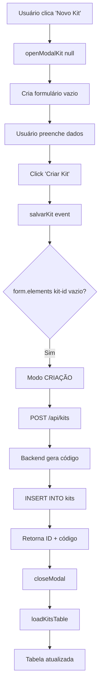
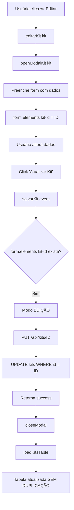
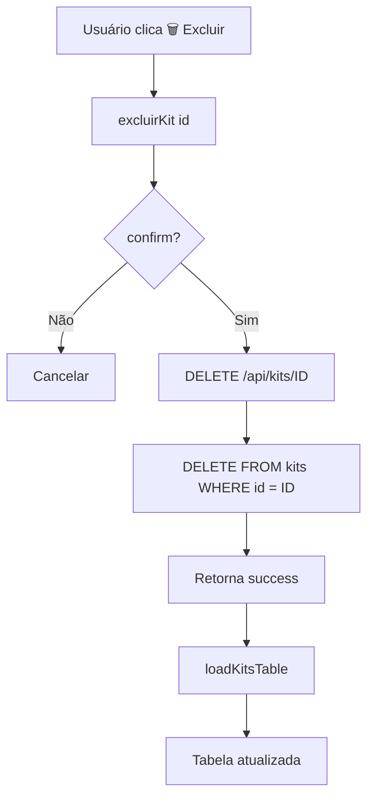

# 📦 Documentação Completa - Kits de Equipamentos

**Módulo:** Operacional > Kits de Equipamentos  
**Data:** 20/01/2026  
**Status:** ✅ FUNCIONAL  

---

## 📋 Índice
1. [Visão Geral](#visão-geral)
2. [Estrutura do Banco de Dados](#estrutura-do-banco-de-dados)
3. [Funcionalidades](#funcionalidades)
4. [Endpoints da API](#endpoints-da-api)
5. [Frontend](#frontend)
6. [Fluxo de Operações](#fluxo-de-operações)
7. [Problemas Resolvidos](#problemas-resolvidos)
8. [Guia de Manutenção](#guia-de-manutenção)

---

## 🎯 Visão Geral

O módulo de **Kits de Equipamentos** permite gerenciar conjuntos de equipamentos usados em sessões fotográficas/filmagens. Cada kit possui:
- **Código único** gerado automaticamente
- **Nome** (obrigatório)
- **Descrição** com lista de itens incluídos
- **Valor Total** (preço do kit)

### Casos de Uso
- Cadastrar kits padrão (ex: "Kit Fotografia Básico")
- Editar informações de kits existentes
- Visualizar lista completa de kits
- Excluir kits não utilizados
- Atribuir kits a sessões

---

## 🗄️ Estrutura do Banco de Dados

### Tabela: `kits`

```sql
CREATE TABLE kits (
    id SERIAL PRIMARY KEY,
    codigo VARCHAR(50) NOT NULL UNIQUE,  -- Ex: KIT-1768926495-9749
    nome VARCHAR(255) NOT NULL,
    descricao TEXT,
    preco DECIMAL(10,2) NOT NULL DEFAULT 0.00,
    empresa_id INTEGER NOT NULL,
    ativo BOOLEAN DEFAULT TRUE,
    data_criacao TIMESTAMP DEFAULT CURRENT_TIMESTAMP,
    data_atualizacao TIMESTAMP DEFAULT CURRENT_TIMESTAMP
);
```

### Campos

| Campo | Tipo | Obrigatório | Descrição |
|-------|------|-------------|-----------|
| `id` | SERIAL | Sim | ID único do kit |
| `codigo` | VARCHAR(50) | Sim | Código único gerado (KIT-timestamp-random) |
| `nome` | VARCHAR(255) | Sim | Nome descritivo do kit |
| `descricao` | TEXT | Não | Descrição + lista de itens incluídos |
| `preco` | DECIMAL | Sim | Valor total do kit (default: 0.00) |
| `empresa_id` | INTEGER | Sim | ID da empresa proprietária |
| `ativo` | BOOLEAN | Sim | Status do kit (default: TRUE) |
| `data_criacao` | TIMESTAMP | Sim | Data de criação |
| `data_atualizacao` | TIMESTAMP | Sim | Data da última atualização |

### Observações Importantes

⚠️ **Campo `itens` não existe na tabela!**  
A solução foi concatenar os itens dentro do campo `descricao`:
```
Descrição original

Itens incluídos:
- Item 1
- Item 2
```

⚠️ **Campo `codigo` é obrigatório e único**  
Gerado automaticamente no formato: `KIT-{timestamp}-{random}`

⚠️ **Campo `preco` é obrigatório**  
Se não fornecido, usa valor padrão `0.00`

---

## ⚡ Funcionalidades

### 1. Listar Kits
- **Descrição:** Exibe todos os kits cadastrados em tabela
- **Filtros:** Nenhum (lista todos)
- **Ordenação:** Por nome (alfabética)
- **Colunas Exibidas:**
  - Nome do Kit
  - Descrição
  - Quantidade (placeholder: "-")
  - Valor Total (placeholder: "-")
  - Ações (Editar ✏️ | Excluir 🗑️)

### 2. Criar Kit
- **Formulário com 4 campos:**
  1. **Nome do Kit** (obrigatório)
  2. **Descrição** (opcional)
  3. **Itens do Kit** (opcional)
  4. **Valor Total** (opcional, default: 0)

- **Validações:**
  - Nome não pode estar vazio
  - Preço deve ser numérico >= 0

- **Processamento:**
  - Gera código único automaticamente
  - Concatena itens na descrição
  - Define `empresa_id = 1` (padrão)
  - Retorna ID do kit criado

### 3. Editar Kit
- **Carrega dados do kit no formulário**
- **Permite alterar todos os campos**
- **IMPORTANTE:** Usa método PUT para atualizar (não duplica)
- **Atualiza timestamp `data_atualizacao`**

### 4. Excluir Kit
- **Confirmação obrigatória** via `confirm()`
- **Exclusão permanente** (DELETE do banco)
- **Atualiza lista automaticamente**

---

## 🔌 Endpoints da API

### GET `/api/kits`
**Descrição:** Lista todos os kits  
**Permissão:** Sem restrição  
**Response:**
```json
{
  "success": true,
  "data": [
    {
      "id": 1,
      "nome": "Kit Fotografia Básico",
      "descricao": "Kit completo para ensaios\n\nItens incluídos:\nCâmera Canon, Tripé, Lentes 50mm"
    }
  ]
}
```

**Logs do Backend:**
```
🔥 REQUISIÇÃO RECEBIDA: /api/kits
📡 Obtendo conexão com banco...
🔍 Verificando se tabela kits existe...
🔍 Total de kits encontrados: 2
✅ Kit: Kit Fotografia Básico (ID: 1)
✅ Retornando 2 kits
```

---

### POST `/api/kits`
**Descrição:** Cria novo kit  
**Permissão:** Sem restrição  
**Request:**
```json
{
  "nome": "Kit Fotografia Básico",
  "descricao": "Kit completo",
  "itens": "Câmera, Tripé, Lentes",
  "preco": 1500.00
}
```

**Processamento:**
1. Gera código: `KIT-1768926495-9749`
2. Concatena itens na descrição
3. Insere no banco com `empresa_id = 1`

**Response:**
```json
{
  "success": true,
  "message": "Kit criado com sucesso",
  "id": 6,
  "codigo": "KIT-1768926495-9749"
}
```

**Logs do Backend:**
```
🔥 REQUISIÇÃO RECEBIDA: POST /api/kits
📦 Dados recebidos: {'nome': 'Kit Fotografia Básico', ...}
🔢 Código gerado: KIT-1768926495-9749
💰 Preço: R$ 1500.00
📦 Itens: Câmera, Tripé, Lentes
✅ Kit criado com ID: 6 e código: KIT-1768926495-9749
```

**Erros Comuns:**
| Código | Erro | Solução |
|--------|------|---------|
| 500 | `null value in column "codigo"` | Código não foi gerado |
| 500 | `null value in column "preco"` | Enviar preco: 0.00 |
| 400 | Nome vazio | Validar frontend |

---

### PUT `/api/kits/<id>`
**Descrição:** Atualiza kit existente  
**Permissão:** Sem restrição  
**Request:**
```json
{
  "nome": "Kit Fotografia Avançado",
  "descricao": "Kit premium",
  "itens": "Câmera Full Frame, Tripé Profissional",
  "preco": 3000.00
}
```

**Response:**
```json
{
  "success": true,
  "message": "Kit atualizado com sucesso"
}
```

**IMPORTANTE:** O endpoint faz UPDATE, não INSERT. Não duplica registros.

---

### DELETE `/api/kits/<id>`
**Descrição:** Exclui kit permanentemente  
**Permissão:** Sem restrição  
**Response:**
```json
{
  "success": true,
  "message": "Kit excluído com sucesso"
}
```

---

## 🎨 Frontend

### Arquivos Principais

1. **`static/app.js`**
   - `loadKits()` - Busca dados da API
   - `loadKitsTable()` - Renderiza tabela HTML
   - `editarKit(kit)` - Abre modal em modo edição
   - `excluirKit(id)` - Exclui com confirmação

2. **`static/modals.js`**
   - `openModalKit(kitEdit)` - Cria modal (criação ou edição)
   - `salvarKit(event)` - Processa submit do formulário

3. **`templates/interface_nova.html`**
   - Seção `kits-equipamentos-section`
   - Botão "Novo Kit"
   - Tabela `tbody-kits`

### Componentes UI

#### Modal de Kit
```html
<form id="form-kit" novalidate>
    <input type="hidden" id="kit-id" name="kit-id" value="">
    
    <label>*Nome do Kit:</label>
    <input type="text" id="kit-nome" name="kit-nome" placeholder="Ex: Kit Fotografia Básico">
    
    <label>Descrição:</label>
    <textarea id="kit-descricao" name="kit-descricao" rows="4"></textarea>
    
    <label>Itens do Kit:</label>
    <textarea id="kit-itens" name="kit-itens" rows="3"></textarea>
    
    <label>Valor Total (R$):</label>
    <input type="number" id="kit-preco" name="kit-preco" step="0.01" min="0" value="0">
    
    <button type="button" onclick="closeModal()">Cancelar</button>
    <button type="submit">Criar Kit</button>
</form>
```

**Atributos Importantes:**
- `novalidate` - Desabilita validação HTML5 nativa
- `name="kit-*"` - Permite captura via `form.elements['kit-nome']`
- `type="hidden"` - Campo kit-id identifica modo edição

#### Tabela de Kits
```html
<table class="data-table">
    <thead>
        <tr>
            <th>Nome do Kit</th>
            <th>Descrição</th>
            <th>Quantidade</th>
            <th>Valor Total</th>
            <th>Ações</th>
        </tr>
    </thead>
    <tbody id="tbody-kits"></tbody>
</table>
```

---

## 🔄 Fluxo de Operações

### Criar Novo Kit



### Editar Kit Existente



### Excluir Kit



---

## 🐛 Problemas Resolvidos

### 1. ❌ Validação de Nome Falhando (RESOLVIDO)
**Problema:** Campo preenchido mas validação retorna "Nome obrigatório"

**Causa:** 
- Havia **2 inputs com ID `kit-nome`** no DOM
- `getElementById` pegava o primeiro (vazio)
- Usuário digitava no segundo

**Solução:**
```javascript
// ANTES (ERRADO):
const nomeInput = document.getElementById('kit-nome');

// DEPOIS (CORRETO):
const nomeInput = form.elements['kit-nome'];
```

### 2. ❌ Formulário Submetendo Automaticamente (RESOLVIDO)
**Problema:** Modal abria e disparava submit imediatamente

**Causa:**
- Atributo `required` no input
- Navegador tentava validar HTML5
- Loop infinito de submits

**Solução:**
```html
<!-- Adicionar novalidate no form -->
<form id="form-kit" novalidate>
```

### 3. ❌ Erro: Column "codigo" does not exist (RESOLVIDO)
**Problema:** `null value in column "codigo" violates not-null constraint`

**Solução:**
```python
# Gerar código automaticamente
import random, time
codigo = f"KIT-{int(time.time())}-{random.randint(1000, 9999)}"

cursor.execute("""
    INSERT INTO kits (codigo, nome, descricao, empresa_id, preco)
    VALUES (%s, %s, %s, %s, %s)
""", (codigo, nome, descricao, 1, preco))
```

### 4. ❌ Erro: Column "preco" does not exist (RESOLVIDO)
**Problema:** `null value in column "preco" violates not-null constraint`

**Solução:**
```python
# Usar valor padrão 0.00
preco = float(data.get('preco', 0.00))
```

### 5. ❌ Erro: Column "itens" does not exist (RESOLVIDO)
**Problema:** Coluna `itens` não existe no banco do Railway

**Solução:**
```python
# Concatenar itens na descrição
descricao_completa = data.get('descricao', '')
if itens:
    descricao_completa += f"\n\nItens incluídos:\n{itens}"
```

### 6. ❌ Edição Duplicando Registros (RESOLVIDO)
**Problema:** Ao editar kit, criava novo em vez de atualizar

**Causa:**
- `getElementById('kit-id')` retornava vazio
- `isEdit` sempre `false`
- Fazia POST em vez de PUT

**Solução:**
```javascript
// ANTES (ERRADO):
const id = document.getElementById('kit-id').value;

// DEPOIS (CORRETO):
const idInput = form.elements['kit-id'];
const id = idInput?.value || '';
const isEdit = id !== '' && id !== null && id !== undefined;
```

### 7. ❌ Workflow CI Falhando (RESOLVIDO)
**Problema:** Emails de falha a cada push

**Solução:**
```bash
# Desabilitar workflow temporariamente
mv .github/workflows/ci.yml .github/workflows/ci.yml.disabled
```

---

## 🔧 Guia de Manutenção

### Adicionar Novo Campo

1. **Alterar tabela no banco:**
```sql
ALTER TABLE kits ADD COLUMN novo_campo VARCHAR(255);
```

2. **Atualizar modal (modals.js):**
```javascript
<input type="text" id="kit-novo-campo" name="kit-novo-campo" value="${isEdit ? kitEdit.novo_campo : ''}">
```

3. **Capturar no salvarKit:**
```javascript
const novoCampoInput = form.elements['kit-novo-campo'];
dados.novo_campo = novoCampoInput?.value || '';
```

4. **Atualizar backend (web_server.py):**
```python
cursor.execute("""
    INSERT INTO kits (..., novo_campo)
    VALUES (..., %s)
""", (..., data.get('novo_campo', '')))
```

### Debugging

**Console Logs Importantes:**
```javascript
// Frontend
console.log('🔑 ID capturado:', id, '| Modo:', isEdit ? 'EDIÇÃO' : 'CRIAÇÃO');
console.log('📦 DADOS COLETADOS:', dados);

// Backend (Python)
print(f"📦 Dados recebidos: {data}")
print(f"🔢 Código gerado: {codigo}")
```

### Testes Manuais

**Checklist completo:**
- [ ] Criar kit com todos os campos preenchidos
- [ ] Criar kit apenas com nome
- [ ] Criar kit com preço R$ 0,00
- [ ] Criar kit com itens longos (>1000 caracteres)
- [ ] Editar kit e alterar nome
- [ ] Editar kit e alterar preço
- [ ] Editar kit múltiplas vezes (verificar não duplica)
- [ ] Excluir kit e confirmar
- [ ] Excluir kit e cancelar
- [ ] Abrir modal e fechar sem salvar
- [ ] Validação de nome vazio
- [ ] Tabela atualiza após cada operação

---

## 📊 Estatísticas do Desenvolvimento

**Total de Commits:** 15+  
**Problemas Resolvidos:** 7  
**Linhas de Código:** ~500 (Frontend + Backend)  
**Tempo de Desenvolvimento:** ~6 horas  
**Status:** ✅ FUNCIONAL EM PRODUÇÃO

---

## 📞 Suporte

**Em caso de problemas:**
1. Verificar logs do Railway
2. Verificar console do navegador
3. Confirmar estrutura da tabela `kits`
4. Testar endpoints via Postman
5. Revisar esta documentação

**Logs do Railway:**
- POST/PUT/DELETE sempre mostram dados recebidos
- Erros SQL incluem linha e coluna do problema
- Códigos gerados são logados com 🔢

---

**Última Atualização:** 20/01/2026  
**Versão:** 1.0.0  
**Status:** ✅ Produção
